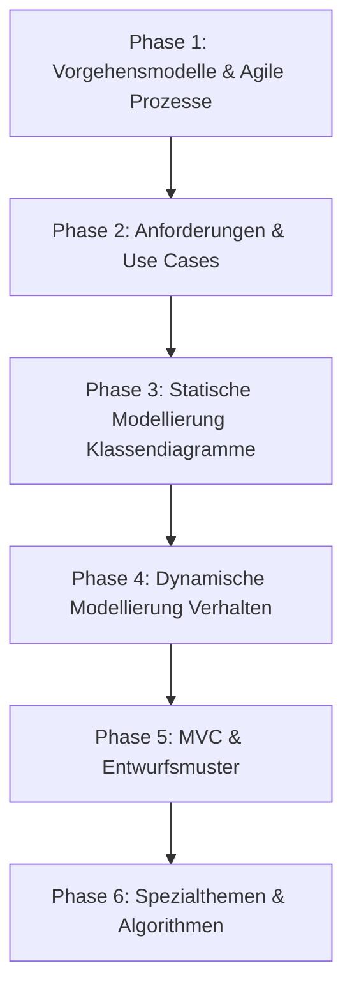

# Lernplan Software Engineering (SWE) 🎓

Dieser Lernplan führt dich Schritt für Schritt durch die klausurrelevanten Themen des Software Engineering anhand der echten Altklausuraufgaben aus deiner Sammlung. Die Aufgaben sind didaktisch von den Grundlagen bis zu komplexen Architektur- und Entwurfsmustern sortiert.

---

## 📅 Übersicht der Phasen

---

## 🛠️ Phase 1: Vorgehensmodelle & Agile Softwareentwicklung (Der Einstieg)
*Ziel: Grundverständnis von klassischen (Wasserfall, Spiralmodell) vs. agilen Entwicklungsprozessen (Scrum, XP) erlangen.*

1. **Einstiegsaufgabe (Sehr gut zum Starten):**
   * **[[Klausur_SoSe2023_Aufgabe1_Vorgehensmodelle_Wasserfall_vs_Agil|SoSe 2023 - Aufgabe 1: Wasserfall vs. Agil]]**
   * *Fokus:* Kernunterschiede, Vor- und Nachteile von klassischen sequentiellen Phasenmodellen im Vergleich zur agilen Entwicklung.
2. **Folgeaufgabe (Vertiefung agile Praktiken):**
   * **[[Klausur_WiSe2021_2022_Aufgabe1_Agile_Entwicklungsprozesse|WiSe 2021/2022 - Aufgabe 1: Agile Entwicklungsprozesse]]**
   * *Fokus:* Praktischer Ablauf agiler Prozesse, Rollen und Artefakte.
3. **Ergänzungsaufgabe (Scrum & XP im Detail):**
   * **[[Klausur_WiSe2024_2025_Aufgabe1_Agile_Entwicklungsprozesse|WiSe 2024/2025 - Aufgabe 1: Agile Entwicklungsprozesse]]**
   * *Fokus:* Detaillierte Fragen zu Scrum-Meetings und Extreme Programming (XP) Praktiken.

---

## 📋 Phase 2: Requirements Engineering & Use Cases (Anforderungsanalyse)
*Ziel: Anforderungen aus Texten extrahieren, Use Cases modellieren sowie Akteure und Beziehungen (include, extend) richtig setzen.*

1. **Einstiegsaufgabe (Grundlagen Use Case Diagramme):**
   * **[[Klausur_SoSe2022_Aufgabe2_Use_Case_Diagramm|SoSe 2022 - Aufgabe 2: Use Case Diagramm]]**
   * *Fokus:* Einfache Modellierung von Akteuren und Systemgrenzen.
2. **Folgeaufgabe (Umgang mit Include & Extend):**
   * **[[Klausur_SoSe2025_Aufgabe2_Use_Case_Diagramm_Tour_App|SoSe 2025 - Aufgabe 2: Use Case Diagramm Tour-App]]**
   * *Fokus:* Modellierung einer mobilen App mit bedingten (`<<extend>>`) und obligatorischen (`<<include>>`) Beziehungen.
3. **Herausforderung (Komplexere Szenarien):**
   * **[[Klausur_WiSe2023_2024_Aufgabe1_Use_Case_Modellierung_Mitfahr_App|WiSe 2023/2024 - Aufgabe 1: Use Case Modellierung Mitfahr-App]]**
   * *Fokus:* Umfangreichere Textbeschreibung in ein sauberes UML-Use-Case-Diagramm übersetzen.

---

## 🏗️ Phase 3: Statische Modellierung (Komponenten- & Klassendiagramme)
*Ziel: Klassen, Attribute, Operationen, Multiplizitäten sowie Vererbung, Assoziation, Aggregation und Komposition sicher anwenden.*

1. **Einstiegsaufgabe (Klassensuche & Basisbeziehungen):**
   * **[[Klausur_SoSe2022_Aufgabe1_Komponenten_Klassen_Objektmodelle|SoSe 2022 - Aufgabe 1: Komponenten, Klassen & Objektmodelle]]**
   * *Fokus:* Textanalyse zur Identifikation von Klassen und Assoziationen.
2. **Folgeaufgabe (Vererbung & Multiplizitäten):**
   * **[[Klausur_SoSe2025_Aufgabe3_Speiseeis_Klassendiagramm|SoSe 2025 - Aufgabe 3: Speiseeis-Klassendiagramm]]**
   * *Fokus:* Modellierung einer komplexeren Vererbungshierarchie mit klaren Bedingungen.
3. **Komponenten & Interfaces (Schnittstellendesign):**
   * **[[Klausur_WiSe2023_2024_Aufgabe2_Komponenten_und_Klassendiagramme|WiSe 2023/2024 - Aufgabe 2: Komponenten und Klassendiagramme]]**
   * *Fokus:* Provided (`o-`) und Required (`-(`) Interfaces im Komponentendiagramm.

---

## 🔄 Phase 4: Dynamische Modellierung (Aktivitäts-, Zustands- & Sequenzdiagramme)
*Ziel: Logische Abläufe, Systeminteraktionen und Objekt-Lebenszyklen modellieren.*

1. **Einstiegsaufgabe (Aktivitätsdiagramme - Kontrollfluss):**
   * **[[Klausur_SoSe2022_Aufgabe3_Activity_Diagramme|SoSe 2022 - Aufgabe 3: Activity-Diagramme]]**
   * *Fokus:* Modellierung von Bedingungen (Decisions), Splits und Joins zur Parallelisierung.
2. **Zustandsdiagramme (Statecharts):**
   * **[[Klausur_WiSe2024_2025_Aufgabe3_Zustandsdiagramm_Elemente|WiSe 2024/2025 - Aufgabe 3: Zustandsdiagramm Elemente]]**
   * *Fokus:* Zustandsübergänge, Guard-Bedingungen, Aktionen (entry/exit) und Unterzustände.
3. **Interaktionen (Sequenzdiagramme & System-Sequenzdiagramme):**
   * **[[Klausur_WiSe2023_2024_Aufgabe4_System_Sequenzdiagramm|WiSe 2023/2024 - Aufgabe 4: System-Sequenzdiagramm]]**
   * *Fokus:* Interaktion zwischen Akteur und System unter Verwendung von Alt- und Loop-Fragmenten.

---

## 🏛️ Phase 5: Softwarearchitektur & Entwurfsmuster (MVC & Design Patterns)
*Ziel: Kopplung minimieren, Kohäsion maximieren und Muster wie MVC, Fassade, Observer und Visitor verstehen und implementieren.*

1. **Einstiegsaufgabe (Schichtenarchitektur & MVC Grundlagen):**
   * **[[Klausur_SoSe2023_Aufgabe3_Schichtenarchitektur_und_MVC|SoSe 2023 - Aufgabe 3: Schichtenarchitektur und MVC]]**
   * *Fokus:* Datenfluss und Abhängigkeiten zwischen Model, View und Controller.
2. **Folgeaufgabe (Verbindung mit Patterns):**
   * **[[Klausur_SoSe2024_Aufgabe2_Fassade_und_MVC_Pattern|SoSe 2024 - Aufgabe 2: Fassade und MVC-Pattern]]**
   * *Fokus:* Wie man das MVC-Pattern durch eine Fassade (Facade) nach außen hin abkapselt.
3. **Herausforderung (Fortgeschrittene Patterns):**
   * **[[Klausur_WiSe2024_2025_Aufgabe4_Visitor_Pattern_und_Sequenzdiagramm|WiSe 2024/2025 - Aufgabe 4: Visitor-Pattern und Sequenzdiagramm]]**
   * *Fokus:* Implementierung des Visitor-Patterns in Java und die dynamische Visualisierung im Sequenzdiagramm.

---

## 🔢 Phase 6: Algorithmen, Datenstrukturen & Implementierung (Klausur-Spezial)
*Ziel: Programmiernahe Aufgaben und Algorithmen im Kontext von UML-Modellen lösen.*

1. **Einstiegsaufgabe (Binaere Suche & Logik):**
   * **[[Klausur_SoSe2024_Aufgabe4_Scheduler_Algorithmen_und_Binaere_Suche|SoSe 2024 - Aufgabe 4: Scheduler-Algorithmen und Binäre Suche]]**
   * *Fokus:* Einfache Algorithmen verstehen und abbilden.
2. **Graphenalgorithmen (Breitensuche - BFS):**
   * **[[Klausur_WiSe2023_2024_Aufgabe5_Graphen_Durchsuchung_Breitensuche|WiSe 2023/2024 - Aufgabe 5: Graphen-Durchsuchung & Breitensuche]]**
   * *Fokus:* BFS-Algorithmus in einer graphbasierten Datenstruktur anwenden und im Sequenzdiagramm darstellen.
3. **Dynamische Programmierung (Memoization):**
   * **[[Klausur_WiSe2022_2023_Aufgabe4_Dynamische_Programmierung_und_Sequenzdiagramme|WiSe 2022/2023 - Aufgabe 4: Dynamische Programmierung und Sequenzdiagramme]]**
   * *Fokus:* Fibonacci-Berechnung mit Memoization entwerfen und Aufrufe im Sequenzdiagramm nachvollziehen.
