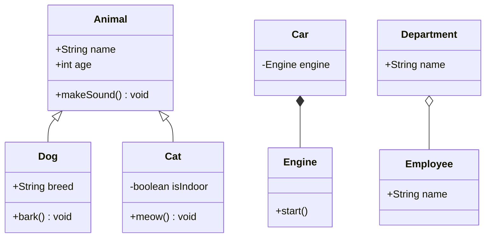
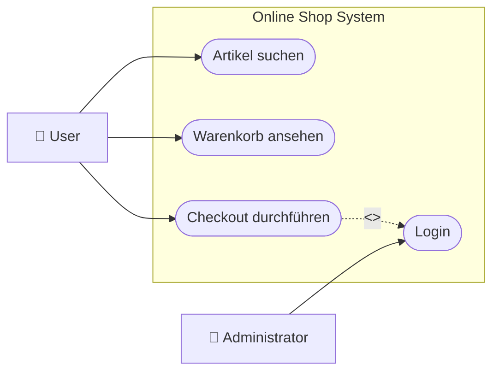
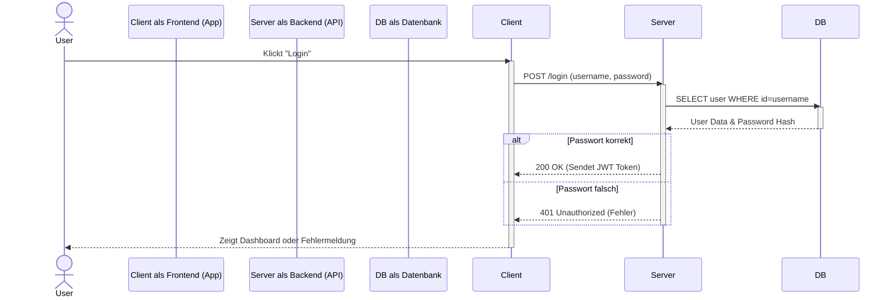
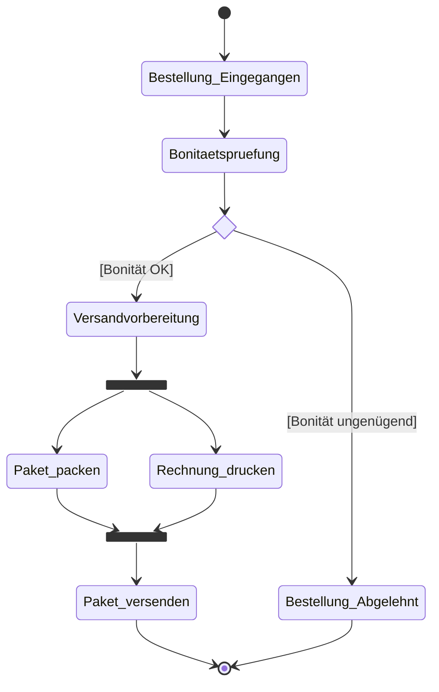
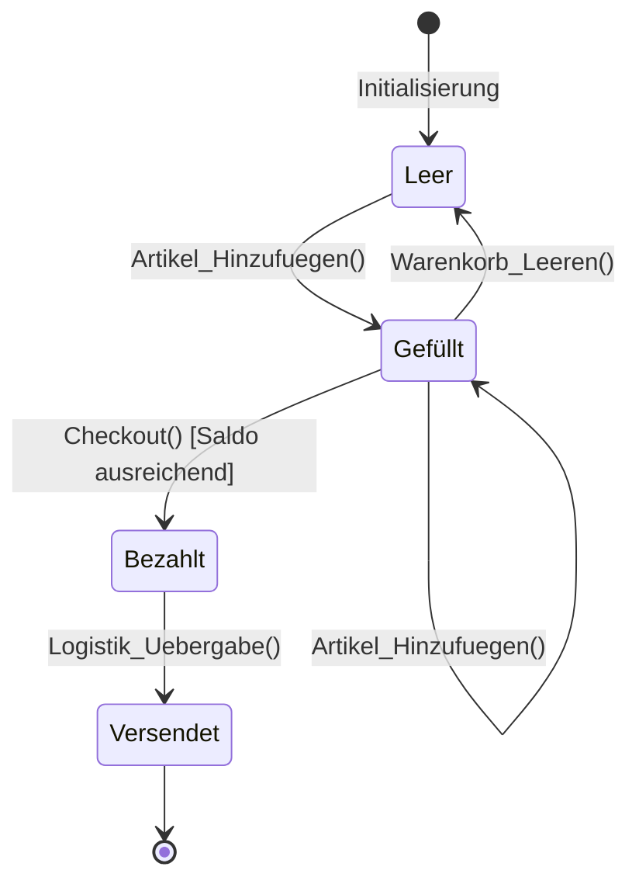

# UML Diagramme - Cheatsheet

Dieses Cheatsheet bietet dir einen Überblick über die wichtigsten und am häufigsten verwendeten UML (Unified Modeling Language) Diagramme. Der Fokus liegt dabei auf der Beschreibung (wann und warum man sie nutzt, Hauptbestandteile) sowie einem direkten visuellen Beispiel, das mit Mermaid generiert wurde.

---

## 1. Klassendiagramm (Class Diagram)

**Beschreibung:**
Das Klassendiagramm ist das wichtigste Strukturdiagramm in der Softwareentwicklung. Es zeigt die statische Architektur eines Systems, indem es die Klassen, ihre Eigenschaften (Attribute), ihr Verhalten (Methoden/Operationen) und ihre Beziehungen untereinander darstellt. Es zeigt *nicht* den zeitlichen Ablauf, sondern den logischen Bauplan.

**Wann verwenden?**
- Zur Modellierung von Datenbankstrukturen.
- Zur Planung der Softwarearchitektur vor der Programmierung.
- Um das fachliche Domänenmodell zu visualisieren.

**Hauptbestandteile:**
- **Klassen:** Ein Rechteck, meist aufgeteilt in drei Bereiche: Klassenname, Attribute (Variablen), Operationen (Methoden).
    ```mermaid
    classDiagram
        class User {
            +String name
            +login() void
        }
    ```
- **Sichtbarkeitsmodifikatoren:** 
- `+` (public/öffentlich), 
- `-` (private/privat), 
- `#` (protected/geschützt).
- **Beziehungen:**
  - **Vererbung / Generalisierung:** Ein Objekt "ist ein" anderes Objekt. (Durchgezogene Linie, hohler Pfeil).
    ```mermaid
    classDiagram
        Animal <|-- Dog
        Animal <|-- Cat
    ```
  - **Komposition:** Eine strenge "Teil-Ganzes"-Beziehung. Wird das Ganze gelöscht, stirbt auch das Teil. (Gefüllte Raute).
    ```mermaid
    classDiagram
        Car *-- Engine
    ```
  - **Aggregation:** Eine lockere "Teil-Ganzes"-Beziehung. Das Teil kann auch ohne das Ganze existieren. (Hohle Raute).
    ```mermaid
    classDiagram
        Department o-- Employee
    ```
  - **Assoziation:** Einfache Verbindung/Kenntnis voneinander.
- **Multiplizitäten (Kardinalitäten):** Definieren, wie viele Objekte an einer Beziehung beteiligt sein können (z.B. `1`, `0..1`, `1..*`, `*`).
    ```mermaid
    classDiagram
        Customer "1" -- "0..*" Order
    ```
- **Interfaces (Schnittstellen):** Definieren Verträge, die Klassen erfüllen müssen. Werden mit `<<interface>>` gekennzeichnet.
    ```mermaid
    classDiagram
        class Drawable {
            <<interface>>
            +draw() void
        }
    ```



---

## 2. Anwendungsfalldiagramm (Use Case Diagram)

**Beschreibung:**
Ein Anwendungsfalldiagramm ist ein Verhaltensdiagramm. Es beschreibt das System aus der Sicht der Benutzer (Akteure). Es zeigt *was* ein System leisten soll (die Funktionen oder Use Cases) und wer mit diesen Funktionen interagiert, aber absolut nicht *wie* diese Funktionen intern programmiert sind.

**Wann verwenden?**
- In der frühen Anforderungsanalyse (Requirements Engineering).
- Zur Festlegung der Systemgrenzen (Was gehört zur Software, was ist extern?).
- Um Stakeholdern einen schnellen Überblick über die Features zu geben.

**Hauptbestandteile:**
- **Akteur (Actor):** Oft ein Strichmännchen. Repräsentiert Menschen, externe Systeme oder Hardware, die mit dem System kommunizieren.
    ```mermaid
    flowchart LR
        User["👤 User"]
    ```
- **Use Case:** Ein Oval. Beschreibt eine fachliche Funktion (z.B. "Geld abheben").
    ```mermaid
    flowchart LR
        UC1([Geld abheben])
    ```
- **Systemgrenze:** Ein großer Kasten, der alle Use Cases umschließt. Akteure stehen immer außerhalb.
    ```mermaid
    flowchart LR
        subgraph Bank-System
            UC1([Geld abheben])
        end
    ```
- **Beziehungen:**
  - **`<<include>>`**: Ein Use Case ruft immer zwingend einen anderen Use Case auf (z.B. "Bestellung aufgeben" inkludiert "Warenkorb prüfen").
    ```mermaid
    flowchart LR
        UC_Bestellung([Bestellung aufgeben]) -.->|<<include>>| UC_Warenkorb([Warenkorb prüfen])
    ```
  - **`<<extend>>`**: Ein Use Case erweitert einen anderen unter bestimmten Bedingungen (Optionales Verhalten).
    ```mermaid
    flowchart LR
        UC_Gutschein([Gutschein einlösen]) -.->|<<extend>>| UC_Bestellung([Bestellung aufgeben])
    ```

*(Hinweis: Mermaid hat keine perfekte native Unterstützung für klassische Use Case Diagramme, oft behilft man sich hierbei mit Flowcharts für die Systemgrenzen.)*



---

## 3. Sequenzdiagramm (Sequence Diagram)

**Beschreibung:**
Das Sequenzdiagramm ist ein Interaktionsdiagramm. Es zeigt den zeitlichen Ablauf (von oben nach unten), in dem Objekte miteinander kommunizieren, um eine bestimmte Aufgabe (oft einen einzelnen Use Case) zu erfüllen. Es visualisiert den Nachrichtenaustausch.

**Wann verwenden?**
- Zur detaillierten Planung komplexer Logik oder Algorithmen.
- Um das Zusammenspiel in einer API, bei Netzwerkprotokollen oder Microservices darzustellen (z.B. Login-Ablauf über Frontend, Backend und Datenbank).

**Hauptbestandteile:**
- **Lebenslinie (Lifeline):** Gestrichelte senkrechte Linien, die die Lebensdauer eines Objekts darstellen.
    ```mermaid
    sequenceDiagram
        participant Backend
    ```
- **Aktivierungsbalken:** Verdickte Bereiche auf der Lebenslinie, die zeigen, wann das Objekt gerade rechnet bzw. aktiv an dem Prozess teilnimmt.
    ```mermaid
    sequenceDiagram
        activate Server
        Server-->>Client: processing
        deactivate Server
    ```
- **Nachrichten (Pfeile):**
  - **Synchron:** Durchgezogene Linie, gefüllter Pfeil (Sender wartet, bis der Empfänger fertig ist).
    ```mermaid
    sequenceDiagram
        Client->>Server: request()
    ```
  - **Asynchron:** Durchgezogene Linie, offener Pfeil (Sender sendet und macht sofort weiter).
    ```mermaid
    sequenceDiagram
        Client-)Server: notify()
    ```
  - **Antwort (Return):** Gestrichelte Linie, offener Pfeil.
    ```mermaid
    sequenceDiagram
        Server-->>Client: response
    ```
- **Fragmente:** Rahmen (alt, opt, loop), um if-else-Bedingungen, optionale Schritte oder Schleifen darzustellen.
    ```mermaid
    sequenceDiagram
        alt success
            Server-->>Client: 200 OK
        else failure
            Server-->>Client: 400 Error
        end
    ```



---

## 4. Aktivitätsdiagramm (Activity Diagram)

**Beschreibung:**
Das Aktivitätsdiagramm ist das UML-Äquivalent zu einem Flussdiagramm (Flowchart). Es beschreibt prozedurale Logik, Geschäftsprozesse und Arbeitsabläufe. Der Fokus liegt auf dem Kontrollfluss von einer Aktion zur nächsten.

**Wann verwenden?**
- Um komplexe Algorithmen oder Logik-Verzweigungen detailliert abzubilden.
- Um Geschäftsprozesse (z.B. wie eine Bestellung bearbeitet wird) zu dokumentieren.
- Um parallele Prozesse (Multithreading) zu veranschaulichen.

**Hauptbestandteile:**
- **Startknoten:** Ein schwarzer ausgefüllter Kreis.
    ```mermaid
    stateDiagram-v2
        [*] --> Start
    ```
- **Endknoten:** Ein ausgefüllter Kreis mit Umrandung.
    ```mermaid
    stateDiagram-v2
        Ende --> [*]
    ```
- **Aktivität / Aktion:** Abgerundete Rechtecke, die den eigentlichen Prozessschritt beschreiben.
    ```mermaid
    stateDiagram-v2
        state "Paket packen" as P
    ```
- **Entscheidungsknoten (Decision):** Eine Raute. An den ausgehenden Pfeilen stehen Bedingungen (Guards) in eckigen Klammern `[Bedingung]`.
    ```mermaid
    stateDiagram-v2
        state if_state <<choice>>
        Prüfung --> if_state
        if_state --> Akzeptiert : [OK]
        if_state --> Abgelehnt : [Fehler]
    ```
- **Synchronisationsbalken (Fork / Join):** Breite schwarze Linien, um einen Prozess in parallele Fäden aufzuspalten (Fork) oder wieder zusammenzuführen (Join).
    ```mermaid
    stateDiagram-v2
        state fork_state <<fork>>
        state join_state <<join>>
        Start --> fork_state
        fork_state --> Task1
        fork_state --> Task2
        Task1 --> join_state
        Task2 --> join_state
        join_state --> Ende
    ```
- **Swimlanes (Schwimmbahnen / Partitions):** Unterteilen das Diagramm in Verantwortlichkeitsbereiche, um zu zeigen, *wer* (z.B. System, Abteilung, Akteur) eine Aktivität ausführt. (In Mermaid oft via `subgraph` in Flowcharts realisiert).
    ```mermaid
    flowchart TB
        subgraph Kunde
            A(Bestellung aufgeben)
        end
        subgraph System
            B(Bonität prüfen)
        end
        A --> B
    ```
- **Objektknoten (Object Node):** Ein Rechteck, das Daten oder Objekte darstellt, die im Prozessfluss produziert oder konsumiert werden.
    ```mermaid
    stateDiagram-v2
        state "Rechnungsdaten [Objekt]" as Obj
        Rechnung_erstellen --> Obj
        Obj --> Rechnung_drucken
    ```



---

## 5. Zustandsdiagramm (State Machine Diagram)

**Beschreibung:**
Zeigt die verschiedenen Zustände, die ein bestimmtes Objekt im Laufe seiner Existenz einnehmen kann, und durch welche Ereignisse (Events) diese Zustandswechsel (Transitions) ausgelöst werden.

**Wann verwenden?**
- Bei Systemen oder Objekten, deren Verhalten stark von ihrem aktuellen Zustand abhängt (z.B. ein Bankautomat, eine Verkehrsampel, der Status eines Support-Tickets oder Warenkorbs).

**Hauptbestandteile:**
- **Zustand (State):** Abgerundetes Rechteck, benennt den aktuellen Zustand.
    ```mermaid
    stateDiagram-v2
        state "Warenkorb Gefüllt" as WG
    ```
- **Übergang (Transition):** Pfeil, der von einem Zustand zum nächsten zeigt. Wird oft beschriftet mit dem Format `Ereignis [Bedingung] / Aktion`.
    ```mermaid
    stateDiagram-v2
        Leer --> Gefüllt : Artikel_hinzufuegen() [Auf Lager]
    ```
- **Zusammengesetzter Zustand (Composite State):** Ein Zustand, der intern weitere Sub-Zustände enthält.
    ```mermaid
    stateDiagram-v2
        state "Laufend" as L {
            [*] --> Initialisieren
            Initialisieren --> Ausführen
        }
    ```


