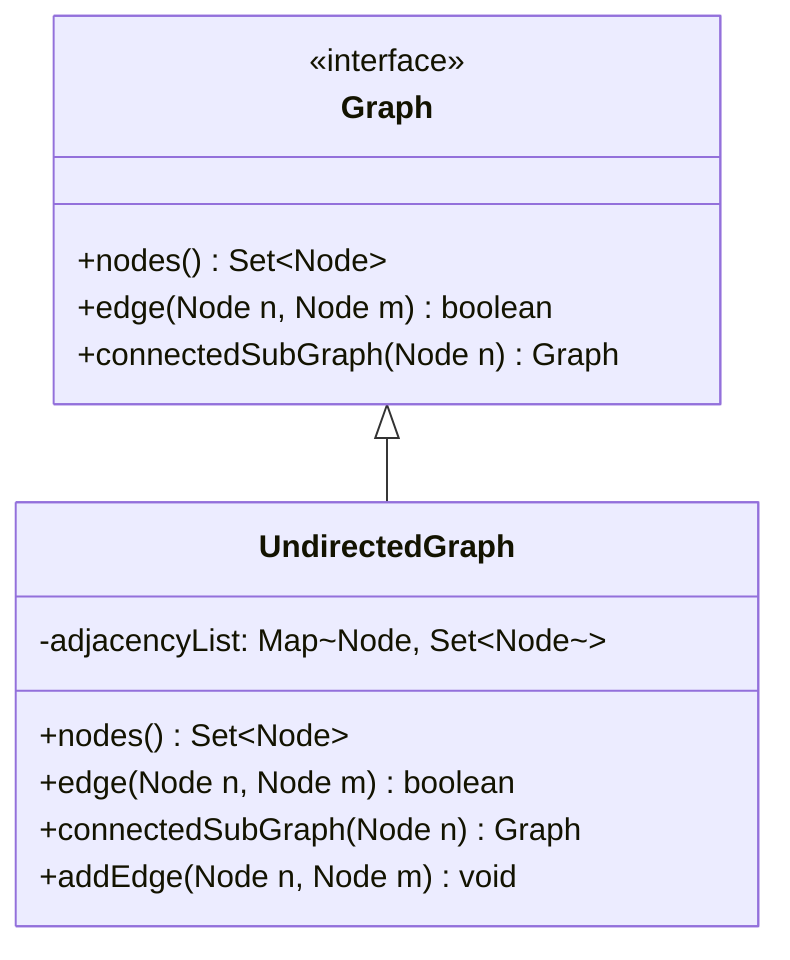

# [[Graph_Datenstruktur]]

- **Kernkonzept:** Ein [[Graph]] ist eine abstrakte Datenstruktur, die aus einer Menge von Knoten (auch: Knotenpunkte, engl. *nodes*) und Kanten (engl. *edges*) besteht. Knoten repräsentieren Entitäten, während Kanten die Beziehungen zwischen diesen Entitäten modellieren. Die gegebene [[Schnittstelle]] `Graph` definiert grundlegende Operationen wie das Abfragen aller Knoten (`nodes()`), das Prüfen einer Kantenverbindung (`edge(Node n, Node m)`) und das Extrahieren eines zusammenhängenden Teilgraphen (`connectedSubGraph(Node n)`). Graphen können gerichtet oder ungerichtet sein und sind zentral für die Modellierung komplexer Netzwerke oder Abhängigkeiten.
- **Nutzen & Zweck:** Graphen werden in der Softwareentwicklung eingesetzt, um Beziehungen und Abhängigkeiten zwischen Objekten oder Daten zu modellieren. Typische Anwendungsfälle umfassen:
- **Netzwerkanalyse** (z. B. soziale Netzwerke, Routenplanung).
- **Abhängigkeitsmanagement** (z. B. Build-Systeme wie Maven, Task-Scheduler).
- **Datenbanken** (z. B. [[Graphdatenbank]] wie Neo4j).
- **Algorithmen** (z. B. [[Tiefensuche]], [[Breitensuche]], [[Dijkstra_Algorithmus]]).
Die [[Schnittstelle]] `Graph` ermöglicht eine klare Trennung zwischen Abstraktion und Implementierung, was die Wiederverwendbarkeit und Testbarkeit erhöht.
- **Abgrenzung & Grenzen:** Graphen unterscheiden sich von anderen Datenstrukturen wie [[Baum]] (ein spezieller Graph ohne Zyklen) oder [[Liste]] (lineare Struktur). Typische Stolpersteine sind:
- **Zyklen**: Können zu unendlichen Schleifen in Algorithmen führen (z. B. bei der [[Tiefensuche]]).
- **Gerichtet vs. ungerichtet**: Eine Kante in einem gerichteten Graphen ist nicht symmetrisch (A→B ≠ B→A).
- **Gewichtete Kanten**: Die gegebene `Graph`-Schnittstelle unterstützt keine Gewichtung; hierfür wäre eine Erweiterung nötig (z. B. `edgeWeight(Node n, Node m)`).
- **Performance**: Operationen wie `connectedSubGraph` können bei großen Graphen ineffizient sein, wenn keine optimierten Datenstrukturen (z. B. [[Adjazenzliste]]) verwendet werden.
- **Beispiel / Code:** ```java
// Beispielimplementierung eines ungerichteten Graphen mit Adjazenzliste
import java.util.*;

public class UndirectedGraph implements Graph {
    private final Map<Node, Set<Node>> adjacencyList = new HashMap<>();

    @Override
    public Set<Node> nodes() {
        return adjacencyList.keySet();
    }

    @Override
    public boolean edge(Node n, Node m) {
        return adjacencyList.getOrDefault(n, Collections.emptySet()).contains(m);
    }

    @Override
    public Graph connectedSubGraph(Node n) {
        Set<Node> visited = new HashSet<>();
        Queue<Node> queue = new LinkedList<>();
        queue.add(n);
        visited.add(n);

        while (!queue.isEmpty()) {
            Node current = queue.poll();
            for (Node neighbor : adjacencyList.getOrDefault(current, Collections.emptySet())) {
                if (!visited.contains(neighbor)) {
                    visited.add(neighbor);
                    queue.add(neighbor);
                }
            }
        }

        UndirectedGraph subGraph = new UndirectedGraph();
        for (Node node : visited) {
            subGraph.adjacencyList.put(node, new HashSet<>(adjacencyList.get(node)));
        }
        return subGraph;
    }

    @Override
    public Iterator<Node> iterator() {
        return nodes().iterator();
    }

    // Hilfsmethode zum Hinzufügen von Knoten und Kanten
    public void addEdge(Node n, Node m) {
        adjacencyList.computeIfAbsent(n, k -> new HashSet<>()).add(m);
        adjacencyList.computeIfAbsent(m, k -> new HashSet<>()).add(n);
    }
}
```

// UML-ähnliche Beschreibung (Mermaid-Notation):

