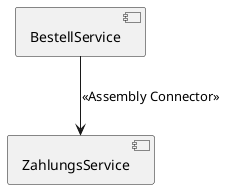

# [[Konnektor]]

- **Kernkonzept:** Ein [[Konnektor]] verbindet [[Komponente|Komponenten]] oder [[Schnittstelle|Schnittstellen]] in der [[Systemarchitektur]] und dient als [[Mechanismus]] zur [[Kommunikation]], [[Koordination]] oder [[Kooperation]] in [[Verteiltes_System|verteilten Systemen]]. Es gibt zwei Haupttypen: *[[Assembly_Connector|Assembly Connector]]* (verbindet [[Komponente|Komponenten]] über [[Schnittstelle|Schnittstellen]]) und *[[Delegation_Connector|Delegation Connector]]* (verbindet externe [[Schnittstelle|Schnittstellen]] mit internen [[Implementierung|Implementierungen]]).
- **Nutzen & Zweck:** Ein [[Konnektor]] ermöglicht die [[Kommunikation]] zwischen [[Komponente|Komponenten]] und fördert die [[Modularität]], [[Erweiterbarkeit]] und [[Wiederverwendbarkeit]] von [[System|Systemen]]. Durch die Bereitstellung standardisierter [[Vermittlung]] von Interaktionen reduziert er die [[Komplexität]] bei der Verbindung heterogener [[System|Systeme]] und unterstützt die [[Lose_Kopplung|lose Kopplung]] in [[Architekturstil|Architekturstilen]]. Dies ist besonders relevant in [[Verteiltes_System|verteilten Systemen]], wo [[Konnektor|Konnektoren]] die [[Koordination]] und [[Kooperation]] zwischen [[Komponente|Komponenten]] über [[Netzwerk|Netzwerke]] hinweg sicherstellen.
- **Abgrenzung & Grenzen:** Ein [[Konnektor]] ist kein Ersatz für die [[Implementierung]] von [[Komponente|Komponenten]] oder [[Schnittstelle|Schnittstellen]], da er lediglich die Verbindung beschreibt, nicht die Logik. Im Gegensatz zu [[API|APIs]] oder [[Direktkommunikation|direkten Prozeduraufrufen]] (z. B. lokale [[Methode|Methoden]]) sind [[Konnektor|Konnektoren]] abstrakter und architekturbezogen. Sie sind ungeeignet, wenn die [[Latenz]] durch [[Vermittlung]] die [[Performance]] unnötig beeinträchtigt oder wenn einfache [[System|Systeme]] mit [[Monolithische_Architektur|monolithischen Architekturen]] effizienter arbeiten. Alternativen wie [[Sockets]] oder [[Middleware]] können in solchen Fällen vorzuziehen sein.
- **Beispiel / Code:** ### Assembly Connector (UML-Beispiel)


### Remote Procedure Call (RPC) als Konnektor
Ein [[Konnektor]] kann als **Remote Procedure Call (RPC)**-Mechanismus implementiert werden, der die [[Kommunikation]] zwischen [[Komponente|Komponenten]] über ein [[Netzwerk]] ermöglicht:

```python
# Client-seitiger RPC-Aufruf (vereinfacht mit RPyC)
import rpyc
conn = rpyc.connect("localhost", 12345)
result = conn.root.add(5, 3)  # Ruft entfernte Methode 'add' auf
```

### Message-Broker als Konnektor
Ein weiteres Beispiel ist ein **[[Message_Broker|Message-Broker]]** (z. B. [[RabbitMQ]]) für asynchrone [[Kommunikation]]:

```java
// Beispiel: Producer sendet Nachricht an RabbitMQ (Java)
import com.rabbitmq.client.Channel;
import com.rabbitmq.client.Connection;
import com.rabbitmq.client.ConnectionFactory;

ConnectionFactory factory = new ConnectionFactory();
try (Connection connection = factory.newConnection();
     Channel channel = connection.createChannel()) {
    channel.queueDeclare("orders", false, false, false, null);
    String message = "Bestellung #123";
    channel.basicPublish("", "orders", null, message.getBytes());
}
```
