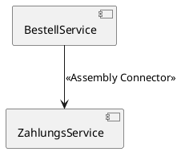

# [[Konnektor]]

- **Kernkonzept:** Ein [[Konnektor]] verbindet [[Komponente|Komponenten]] oder [[Schnittstelle|Schnittstellen]] in der [[Systemarchitektur]] und dient als [[Mechanismus]] zur [[Kommunikation]], [[Koordination]] oder [[Kooperation]] in [[Verteiltes_System|verteilten Systemen]]. Er ermöglicht die [[Interaktion]] zwischen modularen [[Einheit|Einheiten]] über definierte [[Schnittstelle|Schnittstellen]], indem er benötigte oder bereitgestellte [[Interface|Interfaces]] verknüpft und dabei [[Lose_Kopplung|lose Kopplung]] sowie [[Modularität]] fördert.
- **Nutzen & Zweck:** Ein [[Konnektor]] ermöglicht die [[Kommunikation]] zwischen [[Komponente|Komponenten]] und verbessert die [[Wiederverwendbarkeit]], [[Erweiterbarkeit]] und [[Wartbarkeit]] von [[System|Systemen]], indem er direkte [[Abhängigkeit|Abhängigkeiten]] reduziert. Durch standardisierte [[Vermittlung]] von [[Interaktion|Interaktionen]] unterstützt er die [[Lose_Kopplung|lose Kopplung]] in [[Architekturstil|Architekturstilen]] wie [[Serviceorientierte_Architektur|SOA]] oder [[Mikroservice|Mikroservices]] und ist besonders in [[Verteiltes_System|verteilten Systemen]] relevant, wo er die [[Koordination]] und [[Kooperation]] über [[Netzwerk|Netzwerke]] hinweg sicherstellt. Zudem erleichtert er das [[Refactoring]] und die [[Testbarkeit]] von [[Komponente|Komponenten]], da diese unabhängig voneinander entwickelt und ausgetauscht werden können.
- **Abgrenzung & Grenzen:** Ein [[Konnektor]] ist kein Ersatz für die [[Implementierung]] von [[Komponente|Komponenten]] oder [[Schnittstelle|Schnittstellen]], da er lediglich die [[Verbindung]] beschreibt, nicht die [[Logik]]. Im Vergleich zu [[API|APIs]] oder [[Direktkommunikation|direkten Prozeduraufrufen]] (z. B. lokale [[Methode|Methodenaufrufe]]) sind [[Konnektor|Konnektoren]] abstrakter und architekturbezogen. Sie sind ungeeignet, wenn die [[Latenz]] durch [[Vermittlung]] die [[Performance]] unnötig beeinträchtigt oder wenn einfache [[System|Systeme]] mit [[Monolithische_Architektur|monolithischen Architekturen]] effizienter arbeiten. Alternativen wie [[Sockets]], [[Middleware]] oder direkte [[Nachrichtenübermittlung]] können in solchen Fällen vorzuziehen sein. Zudem erfordern [[Konnektor|Konnektoren]] eine sorgfältige Planung der [[Schnittstelle|Schnittstellen]] und [[Interaktionsmuster]], um [[Komplexität]] nicht unnötig zu erhöhen.
- **Beispiel / Code:** ### Assembly Connector (UML-Beispiel)


### Assembly Connector in Java
```java
interface IMemberService {
    void addMember([[Mitglied|Member]] member);
    [[Mitglied|Member]] getMember(int id);
}

class MemberService implements IMemberService {
    public void addMember([[Mitglied|Member]] member) {
        // Implementierung
    }
    public [[Mitglied|Member]] getMember(int id) {
        // Implementierung
        return null;
    }
}

class MemberController {
    private IMemberService memberService;
    
    // Assembly Connector: Verbindung über [[Schnittstelle]]
    public MemberController(IMemberService memberService) {
        this.memberService = memberService;
    }
    
    public void createMember([[Mitglied|Member]] member) {
        memberService.addMember(member);
    }
}
```

### Remote Procedure Call (RPC) als Konnektor
Ein [[Konnektor]] kann als **Remote Procedure Call (RPC)**-Mechanismus implementiert werden, der die [[Kommunikation]] zwischen [[Komponente|Komponenten]] über ein [[Netzwerk]] ermöglicht:

```python
# Client-seitiger RPC-Aufruf (vereinfacht mit RPyC)
import rpyc
conn = rpyc.connect("localhost", 12345)
result = conn.root.add(5, 3)  # Ruft entfernte [[Methode]] 'add' auf
```

### Message-Broker als Konnektor
Ein weiteres Beispiel ist ein **[[Message_Broker|Message-Broker]]** (z. B. [[RabbitMQ]]) für asynchrone [[Kommunikation]]:

```java
// Beispiel: Producer sendet Nachricht an RabbitMQ (Java)
import com.rabbitmq.client.Channel;
import com.rabbitmq.client.Connection;
import com.rabbitmq.client.ConnectionFactory;

ConnectionFactory factory = new ConnectionFactory();
try (Connection connection = factory.newConnection();
     Channel channel = connection.createChannel()) {
    channel.queueDeclare("orders", false, false, false, null);
    String message = "Bestellung #123";
    channel.basicPublish("", "orders", null, message.getBytes());
}
```

---

## 🔗 Stellordnung & Verbindungen
- **Stellordnung ID:** 1c1a2
- **Vorgänger / Parent:** [[Komponenten]]
- **Folgezettel / Unterzettel:**
  - [[Assembly_Connector]]
  - [[Delegation_Connector]]
- **Querverweise:** keine
