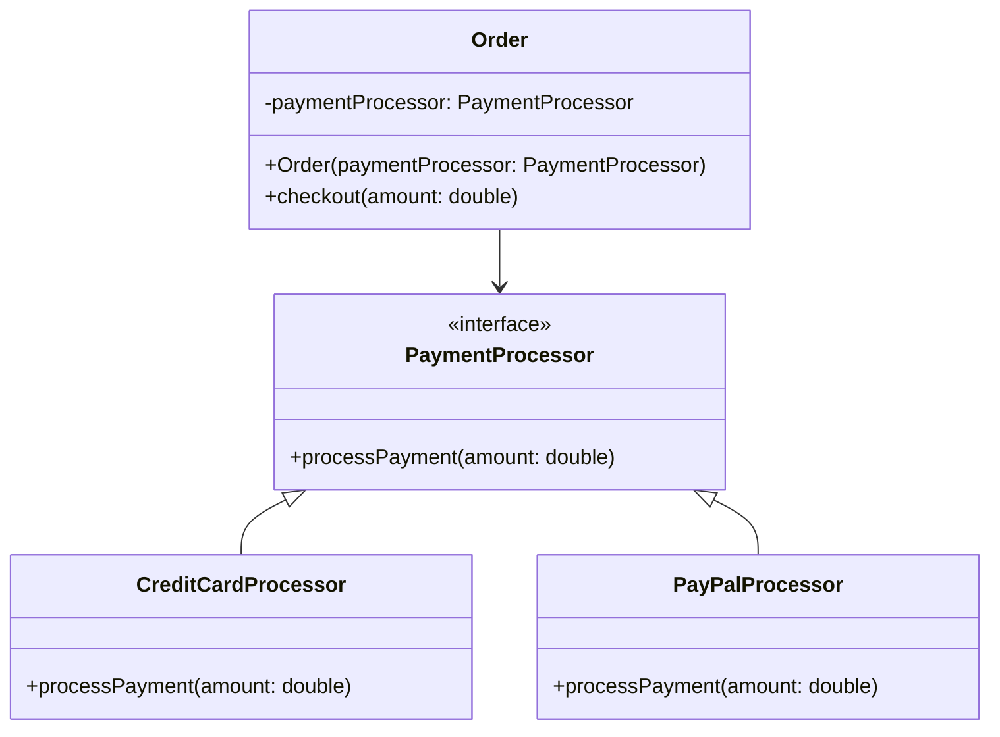

# [[Kopplung]]

- **Kernkonzept:** [[Kopplung]] bezeichnet das Ausmaß der [[Abhängigkeit]] zwischen [[Modul]]en, [[Komponente]]n oder [[Klasse]]n in einem Softwaresystem und misst, wie stark die internen [[Detail]]s eines [[Modul]]s von anderen [[Modul]]en bekannt sind oder genutzt werden. Ziel ist eine [[Lose_Kopplung|lose Kopplung]], bei der [[Änderung]]en in einem [[Modul]] möglichst geringe Auswirkungen auf andere [[Modul]]e haben, was durch klare [[Schnittstelle]]n, [[Information_Hiding]] und [[Abstraktion]] (z. B. über [[Interface]]s oder das [[Fassade_Pattern]]) erreicht wird.
- **Nutzen & Zweck:** [[Lose_Kopplung|lose Kopplung]] ist ein zentrales [[Prinzip]] der [[Softwarearchitektur]] und des [[Entwurf]]s, um folgende Vorteile zu erzielen:
- **Wartbarkeit**: [[Änderung]]en in einem [[Modul]] erfordern weniger Anpassungen in abhängigen [[Modul]]en, was die [[Komplexität]] reduziert und die [[Fehler]]anfälligkeit verringert.
- **Wiederverwendbarkeit**: [[Modul]]e lassen sich leichter in anderen [[Kontext]]en einsetzen, da sie weniger externe [[Abhängigkeit]]en aufweisen.
- **Testbarkeit**: [[Modul]]e können isoliert getestet werden (z. B. durch [[Mock_Objekt]]e), was die [[Qualitätssicherung]] verbessert.
- **Skalierbarkeit**: Systeme lassen sich einfacher erweitern oder umstrukturieren, da [[Abhängigkeit]]en minimiert sind.
- **Robustheit**: [[Fehler]] in einem [[Modul]] propagieren seltener in andere Teile des Systems, was die [[Stabilität]] erhöht.
- **Modularität**: Fördert die Zusammenarbeit in [[Entwicklungsteam]]s, da [[Modul]]e unabhängig entwickelt und gewartet werden können.

Hohe [[Kopplung]] führt dagegen zu "spaghettiartigen" [[Abhängigkeit]]en, die das System unflexibel, schwer wartbar und fehleranfällig machen. In [[Verteiltes_System|verteilten Systemen]] (z. B. [[Microservices]]) ist [[Lose_Kopplung|lose Kopplung]] essenziell, um Netzwerk- und Protokollabhängigkeiten zu minimieren.
- **Abgrenzung & Grenzen:** - **[[Kopplung]] vs. [[Kohäsion]]**: Während [[Kopplung]] die [[Abhängigkeit]] *zwischen* [[Modul]]en beschreibt, bezieht sich [[Kohäsion]] auf die *innere Zusammengehörigkeit* der [[Verantwortlichkeit]]en eines [[Modul]]s. Beide [[Konzept]]e sind komplementär: Hohe [[Kohäsion]] fördert oft [[Lose_Kopplung|lose Kopplung]].
- **Arten der [[Kopplung]]**:
  - **Datenkopplung** (geringste [[Kopplung]]): [[Modul]]e kommunizieren nur über einfache Datenstrukturen (z. B. Parameter).
  - **Stempelkopplung**: [[Modul]]e teilen komplexe Datenstrukturen (z. B. [[Objekt]]e), was [[Abhängigkeit]]en erhöht.
  - **Kontrollkopplung**: Ein [[Modul]] steuert den Ablauf eines anderen (z. B. über Flags), was die [[Flexibilität]] einschränkt.
  - **Inhaltskopplung** (höchste [[Kopplung]]): Ein [[Modul]] greift direkt auf interne Daten oder Logik eines anderen [[Modul]]s zu (z. B. durch `friend`-Klassen in C++).
- **Stolpersteine**:
  - Übermäßige [[Abstraktion]] kann zu unnötiger [[Komplexität]] führen (z. B. zu viele [[Interface]]s).
  - Falsche Anwendung von [[Entwurfsmuster]]n wie das [[Singleton_Pattern]] kann globale [[Abhängigkeit]]en schaffen.
  - Das [[Fassade_Pattern]] kann [[Kopplung]] reduzieren, aber auch eine neue zentrale [[Abhängigkeit]] einführen.
  - In zeitkritischen Systemen kann [[Lose_Kopplung|lose Kopplung]] durch zusätzliche [[Abstraktion]]s-Schichten Overhead verursachen, was die [[Performance]] beeinträchtigt. Hier kann eine gezielte enge [[Kopplung]] sinnvoll sein, birgt jedoch das Risiko schwer wartbarer Architekturen.
- **Grenzen**: In [[Verteiltes_System|verteilten Systemen]] (z. B. [[Microservices]]) ist [[Lose_Kopplung|lose Kopplung]] zwar essenziell, aber Netzwerkkommunikation kann neue [[Abhängigkeit]]en schaffen (z. B. Latenz, Protokollabhängigkeiten). Zudem kann eine zu starke Entkopplung die [[Konsistenz]] von Daten erschweren, insbesondere in [[Event-gesteuertes_System|Event-gesteuerten Systemen]].
- **Beispiel / Code:** ### Beispiel für [[Lose_Kopplung|lose vs. enge Kopplung]] in Java:

#### Lose Kopplung durch [[Dependency_Injection|Dependency Injection]] und [[Interface]]:
```java
public interface PaymentProcessor {
    void processPayment(double amount);
}

public class CreditCardProcessor implements PaymentProcessor {
    @Override
    public void processPayment(double amount) {
        System.out.println("Processing credit card payment: " + amount);
    }
}

public class PayPalProcessor implements PaymentProcessor {
    @Override
    public void processPayment(double amount) {
        System.out.println("Processing PayPal payment: " + amount);
    }
}

public class Order {
    private PaymentProcessor paymentProcessor;

    // Dependency Injection: Der konkrete Processor wird von außen übergeben
    public Order(PaymentProcessor paymentProcessor) {
        this.paymentProcessor = paymentProcessor;
    }

    public void checkout(double amount) {
        paymentProcessor.processPayment(amount);
    }
}

// Verwendung:
Order order = new Order(new CreditCardProcessor());
order.checkout(100.0);
```

#### Enge Kopplung durch direkte [[Abhängigkeit]]:
```java
public class Order {
    private CreditCardProcessor paymentProcessor = new CreditCardProcessor();

    public void checkout(double amount) {
        paymentProcessor.processPayment(amount);
    }
}

public class CreditCardProcessor {
    public void processPayment(double amount) {
        System.out.println("Processing credit card payment: " + amount);
    }
}
```

#### UML-Klassendiagramm zur Veranschaulichung [[Lose_Kopplung|loser Kopplung]]:


---

## 🔗 Stellordnung & Verbindungen
- **Stellordnung ID:** 4a3
- **Vorgänger / Parent:** [[Architekturprinzipien]]
- **Folgezettel / Unterzettel:** keine
- **Querverweise:**
  - [[Architekturprinzipien]]
  - [[Software-Design]]
