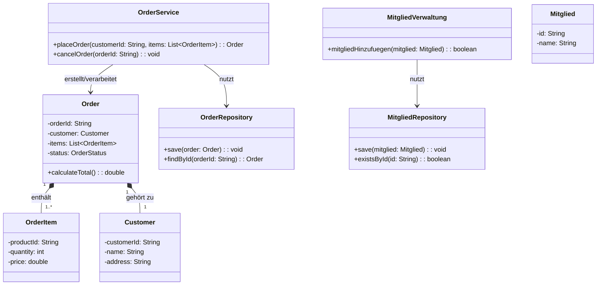

# [[Logikschicht]]

- **Kernkonzept:** Die **Logikschicht** (auch *Geschäftslogikschicht* oder *Business_Logic_Layer* genannt) ist eine zentrale [[Komponente|Komponenten]] in der [[Schichtenarchitektur]] einer Softwareanwendung. Sie kapselt die domänenspezifischen [[Regel|Regeln]], [[Prozess|Prozesse]] und [[Algorithmus|Algorithmen]], die den funktionalen Kern der Anwendung ausmachen, und trennt diese strikt von der [[Präsentationsschicht]] und [[Datenzugriffsschicht]]. Ihre Hauptaufgabe besteht darin, Eingaben aus der [[Präsentationsschicht]] zu verarbeiten, Geschäftslogik auszuführen und Ergebnisse an die [[Präsentationsschicht]] oder [[Datenzugriffsschicht]] weiterzuleiten, ohne dabei von Darstellung oder Datenhaltung abhängig zu sein.
- **Nutzen & Zweck:** Die Logikschicht dient folgenden Zwecken:
- **Trennung von Verantwortlichkeiten**: Durch die Entkopplung von [[Präsentationsschicht]] und [[Datenzugriffsschicht]] wird die [[Wartbarkeit]] und [[Erweiterbarkeit]] der Software verbessert. Änderungen an der Benutzeroberfläche oder Datenhaltung erfordern keine Anpassungen der Geschäftslogik, was die [[Lose_Kopplung|lose Kopplung]] und [[Kohäsion]] fördert.
- **Wiederverwendbarkeit**: Die Geschäftslogik kann in verschiedenen [[Kontext|Kontexten]] (z. B. Desktop-, Web- oder Mobile-Anwendung) genutzt werden, ohne dupliziert zu werden, was die [[Modularität]] der Anwendung erhöht.
- **Testbarkeit**: Da die Logikschicht keine Abhängigkeiten zu UI- oder Datenbank-Frameworks hat, lässt sie sich isoliert mit [[Unit_Test|Unit-Tests]] prüfen, was die [[Softwarequalität]] steigert.
- **Skalierbarkeit**: Die Schicht kann horizontal skaliert werden (z. B. in [[Microservice|Microservices]]-Architekturen), um Last zu verteilen, ohne die [[Architektur]] grundlegend zu ändern.
- **Sicherheit**: Durch die Kapselung der Geschäftslogik können Validierungen und Autorisierungen zentral implementiert werden (z. B. mittels [[MVC_Pattern|MVC-Muster]] oder [[Domain_Driven_Design]]).
- **Vermeidung von Overhead**: Bei sehr einfachen Anwendungen ohne komplexe Geschäftslogik kann der Einsatz einer Logikschicht unnötig sein, da der [[Overhead]] der [[Schichtenarchitektur]] die Vorteile überwiegt.
- **Abgrenzung & Grenzen:** Die Logikschicht grenzt sich wie folgt ab:
- **Von der Präsentationsschicht**: Sie enthält *keinen* Darstellungscode (z. B. HTML, Swing, JavaFX) oder Eingabevalidierung, die ausschließlich der UI-Logik dient. Allerdings führt sie *domänenspezifische Validierungen* (z. B. Geschäftsregeln) durch, die unabhängig von der Benutzeroberfläche sind.
- **Von der Datenzugriffsschicht**: Sie enthält *keine* SQL-Abfragen, [[ORM]]-Konfigurationen (z. B. [[Hibernate]]) oder Dateisystemoperationen. Diese werden in der [[Datenzugriffsschicht]] gekapselt, um die [[Trennung der Verantwortlichkeiten|Trennung der Verantwortlichkeiten]] zu wahren.
- **Stolpersteine**:
  - *Fat Logic Layer*: Eine überladene Logikschicht kann zu monolithischen Strukturen führen. Abhilfe schafft eine weitere Aufteilung (z. B. in [[Service_Layer]] und [[Domain_Model]]).
  - *Verletzung der Schichtengrenzen*: Direkte Abhängigkeiten zwischen [[Präsentationsschicht]] und [[Datenzugriffsschicht]] (z. B. durch *Lazy Loading* in ORMs) untergraben die [[Trennung der Verantwortlichkeiten|Trennung der Verantwortlichkeiten]] und führen zu schwer wartbarem Code.
  - *Technologieabhängigkeit*: Die Logikschicht sollte keine Frameworks-spezifischen Annotationen oder APIs verwenden, um [[Austauschbarkeit]] und [[Portabilität]] zu gewährleisten.
  - *Einfache Anwendungen*: Bei trivialen Anwendungen ohne komplexe Geschäftslogik kann der Einsatz einer Logikschicht unnötigen Overhead verursachen und gegen das [[KISS-Prinzip]] verstoßen.
- **Beispiel / Code:** Das folgende Beispiel veranschaulicht die Logikschicht in einer E-Commerce-Anwendung und einer Mitgliederverwaltung. Die Logikschicht (`OrderService` bzw. `MitgliedVerwaltung`) nutzt das [[Domain_Model]] und delegiert Persistenz an die [[Datenzugriffsschicht]].

**UML-Klassendiagramm (Mermaid-Syntax):**


**Code-Beispiele:**

```java
// Logikschicht: Geschäftslogik für Bestellungen (E-Commerce)
public class OrderService {
    private final OrderRepository orderRepository;
    
    public OrderService(OrderRepository orderRepository) {
        this.orderRepository = orderRepository;
    }
    
    public Order placeOrder(String customerId, List<OrderItem> items) {
        // Domänenspezifische Validierung
        if (items.isEmpty()) {
            throw new IllegalArgumentException("Bestellung muss mindestens ein [[Item|Item]] enthalten");
        }
        
        // Geschäftslogik: Bestellung erstellen
        Customer customer = new Customer(customerId);
        Order order = new Order(customer, items);
        
        // Delegation an Datenzugriffsschicht
        orderRepository.save(order);
        return order;
    }
}

// Domain-Modell (Teil der Logikschicht)
public class Order {
    private String orderId;
    private Customer customer;
    private List<OrderItem> items;
    private OrderStatus status;
    
    public double calculateTotal() {
        return items.stream().mapToDouble(OrderItem::getPrice).sum();
    }
    // ...
}
```

```java
// Logikschicht: Geschäftslogik für Mitgliederverwaltung
public class MitgliedVerwaltung {
    private MitgliedRepository mitgliedRepository;

    public MitgliedVerwaltung(MitgliedRepository mitgliedRepository) {
        this.mitgliedRepository = mitgliedRepository;
    }

    public boolean mitgliedHinzufuegen(Mitglied mitglied) {
        if (mitglied == null || mitglied.getName() == null || mitglied.getName().isEmpty()) {
            throw new IllegalArgumentException("Ungültige Mitgliedsdaten");
        }
        // Geschäftsregel: Mitglied darf nicht bereits existieren
        if (mitgliedRepository.existsById(mitglied.getId())) {
            return false;
        }
        mitgliedRepository.save(mitglied);
        return true;
    }
}
```

---

## 🔗 Stellordnung & Verbindungen
- **Stellordnung ID:** 1c2a2
- **Vorgänger / Parent:** [[Drei-Schichtenmodell]]
- **Folgezettel / Unterzettel:**
  - [[Geschäftslogik]]
  - [[Domänenlogik]]
- **Querverweise:**
  - [[Model-View-Controller]]
