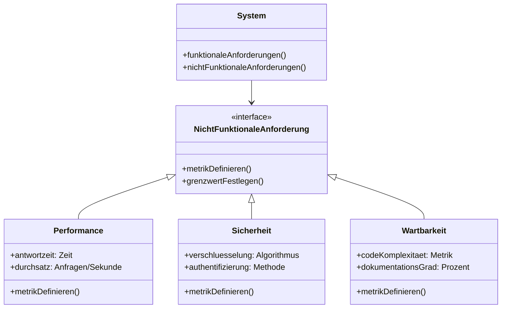

# [[Nicht_funktionale_Anforderung]]

- **Kernkonzept:** Nicht-funktionale [[Anforderung|Anforderungen]] (NFA) definieren die [[Qualität|Qualitätsmerkmale]] und [[Rahmenbedingung|Rahmenbedingungen]] eines [[Softwaresystem|Softwaresystems]], die über die reine [[Funktionalität]] hinausgehen. Sie beschreiben, wie gut das System seine Aufgaben erfüllt – etwa hinsichtlich [[Performance]], [[Sicherheit]], [[Benutzerfreundlichkeit]], [[Wartbarkeit]], [[Verfügbarkeit]] oder [[Skalierbarkeit]] – und werden durch [[Metrik|Metriken]] operationalisierbar gemacht, um subjektive Erwartungen messbar zu gestalten.
- **Nutzen & Zweck:** Nicht-funktionale [[Anforderung|Anforderungen]] dienen dazu, die [[Qualität]] und [[Akzeptanz]] eines [[Softwaresystem|Softwaresystems]] sicherzustellen, indem sie nicht-funktionale Aspekte wie [[Skalierbarkeit]], [[Zuverlässigkeit]], [[Compliance]], [[Benutzererlebnis]], [[Performance]] oder [[Sicherheit]] explizit definieren und priorisieren. Sie sind entscheidend für die [[Softwarearchitektur]], da sie die Wahl von [[Entwurfsmuster|Entwurfsmustern]] (z. B. [[CQRS]] für [[Performance]]) oder [[Technologie|Technologien]] (z. B. [[Datenbank|Datenbanken]] für [[Skalierbarkeit]]) beeinflussen. Durch die Quantifizierung mittels [[Metrik|Metriken]] ermöglichen sie eine objektive [[Qualitätssicherung]], [[Risikomanagement]] und frühzeitige Berücksichtigung von [[Qualitätsziel|Qualitätszielen]] im [[Entwicklungsprozess]]. Ohne NFA bleiben subjektive Erwartungen (z. B. "benutzerfreundlich") vage und schwer verhandelbar, was zu späteren Konflikten, [[Technische_Schuld|technischer Schuld]] oder [[Systemausfall|Systemausfällen]] führt. Sie lösen das Problem, dass rein funktionale Spezifikationen oft unzureichend sind, um kritische [[Qualitätsziel|Qualitätsziele]] wie [[Antwortzeit|Antwortzeiten]], [[Datenschutz]] oder [[Benutzerfreundlichkeit]] zu adressieren. Ohne sie riskiert man [[Softwaresystem|Systeme]], die zwar funktionieren, aber inakzeptable [[Performance]], hohe [[Betriebskosten]] oder [[Sicherheitslücke|Sicherheitslücken]] aufweisen.
- **Abgrenzung & Grenzen:** Nicht-funktionale [[Anforderung|Anforderungen]] unterscheiden sich von [[funktionale_Anforderung|funktionalen Anforderungen]] dadurch, dass letztere konkrete [[Funktionalität|Funktionen]] oder [[Verhalten]] des Systems beschreiben (z. B. "Das System muss [[Bestellung|Bestellungen]] speichern"), während NFA [[Qualität|Qualitätseigenschaften]] oder [[Betriebsbedingung|Betriebsbedingungen]] adressieren. Typische Herausforderungen und Grenzen umfassen:

- **Subjektivität & Messbarkeit**: Ohne klare [[Metrik|Metriken]] sind NFA schwer verhandelbar (z. B. "Das System soll [[Benutzerfreundlichkeit|benutzerfreundlich]] sein"). [[Qualitätsmodell|Qualitätsmodelle]] wie [[ISO_25010]] helfen, solche [[Anforderung|Anforderungen]] zu strukturieren und messbar zu machen.
- **Konflikte**: NFA können sich widersprechen (z. B. hohe [[Sicherheit]] vs. hohe [[Performance]]), was [[Trade-off|Trade-offs]] in der [[Softwarearchitektur]] erfordert. Beispielsweise kann eine starke [[Verschlüsselung]] die [[Antwortzeit]] erhöhen.
- **Implizite Annahmen**: NFA wie [[Verfügbarkeit]] oder [[Skalierbarkeit]] werden oft als selbstverständlich vorausgesetzt und erst spät im Projekt thematisiert, was zu [[Technische_Schuld|technischer Schuld]] oder unerwarteten [[Betriebskosten]] führt.
- **Priorisierung**: Nicht alle NFA sind gleich kritisch. Eine [[Risikoanalyse]] hilft, sie nach [[Geschäftswert]] und [[Umsetzungsaufwand]] zu gewichten. Beispielsweise ist [[Verfügbarkeit]] für ein [[E-Commerce-System]] kritischer als für einen internen Prototypen.
- **Alternativen**: In Projekten mit geringem [[Qualitätsanspruch]] (z. B. Prototypen) können NFA vernachlässigt werden, sofern [[Funktionalität]] im Vordergrund steht. Allerdings riskiert dies spätere [[Refactoring|Refactorings]], [[Systemausfall|Systemausfälle]] oder hohe [[Wartungskosten]].
- **Abgrenzung zu Lösungen**: NFA sollten nicht mit technischen Lösungen verwechselt werden (z. B. "Datenbank X verwenden"), sondern als Ziele formuliert sein (z. B. "99,9% [[Verfügbarkeit]]"). Technische Lösungen sind Mittel zur Erfüllung von NFA, nicht die [[Anforderung]] selbst.
- **Vertragliche Relevanz**: Implizite Annahmen oder informelle Absprachen sind ungeeignet, da sie nicht messbar, nachprüfbar oder vertraglich bindend sind. NFA müssen explizit dokumentiert und mit [[Metrik|Metriken]] hinterlegt sein, um im [[Requirements-Engineering]] oder [[Vertragsmanagement]] wirksam zu sein.
- **Beispiel / Code:** ```java
// Beispiel für eine nicht-funktionale Anforderung in einem Lastenheft:

/**
 * Nicht-funktionale Anforderung: Performance
 * Das System muss 95% aller Leseanfragen an die Mitgliederdatenbank
 * innerhalb von 200 Millisekunden unter einer Last von 1000 gleichzeitigen
 * Benutzern beantworten.
 *
 * Messmethode: Automatisierte Lasttests mit JMeter, 30-minütige Dauer,
 * 95%-Perzentil der Antwortzeiten.
 * Grenzwert: ≤ 200 ms für 95% der Anfragen.
 */
public class NonFunctionalRequirements {
    // Kein ausführbarer Code, sondern dokumentierte Spezifikation
}

// Beispiel: Umsetzung einer Sicherheits-NFA in Java
import javax.net.ssl.SSLContext;
import java.security.NoSuchAlgorithmException;

public class SecurityExample {
    public static void main(String[] args) {
        try {
            SSLContext sslContext = SSLContext.getInstance("TLSv1.3");
            sslContext.init(null, null, null);
            System.out.println("Verschlüsselung gemäß nicht-funktionaler Anforderung aktiviert.");
        } catch (NoSuchAlgorithmException e) {
            System.err.println("Fehler: TLS 1.3 nicht unterstützt. Anforderung verletzt!");
        }
    }
}
```

**Textuelle Beispiele mit [[Metrik|Metriken]] und [[Grenzwert|Grenzwerten]]:**

1. **[[Verfügbarkeit]]**
   - **NFA**: "Das System muss 99,9% der Zeit verfügbar sein."
   - **Metrik**: Verfügbarkeit = (Gesamtzeit - Ausfallzeit) / Gesamtzeit * 100.
   - **Grenzwert**: ≥ 99,9%.
   - **Umsetzung**: Einsatz von [[Redundanz]] und [[Load_Balancing]].

2. **[[Sicherheit]]**
   - **NFA**: "Alle personenbezogenen [[Daten]] müssen verschlüsselt übertragen werden."
   - **Metrik**: Verschlüsselungsstandard (z. B. TLS 1.3 oder höher).
   - **Grenzwert**: TLS 1.3.
   - **Umsetzung**: Konfiguration der [[Schnittstelle|Schnittstellen]] mit modernen [[Verschlüsselungsprotokoll|Verschlüsselungsprotokollen]].

3. **[[Wartbarkeit]]**
   - **NFA**: "Der [[Code]] soll eine zyklomatische Komplexität von ≤ 10 pro [[Methode]] aufweisen."
   - **Metrik**: Zyklomatische Komplexität (gemessen mit Tools wie SonarQube).
   - **Grenzwert**: ≤ 10.
   - **Umsetzung**: Regelmäßige [[Code_Review|Code-Reviews]] und [[Refactoring]] zur Reduktion von [[Komplexität]].



---

## 🔗 Stellordnung & Verbindungen
- **Stellordnung ID:** 2a2
- **Vorgänger / Parent:** [[Anforderungsidentifikation]]
- **Folgezettel / Unterzettel:** keine
- **Querverweise:**
  - [[Anforderungsanalyse]]
  - [[Qualitätsattribute]]
