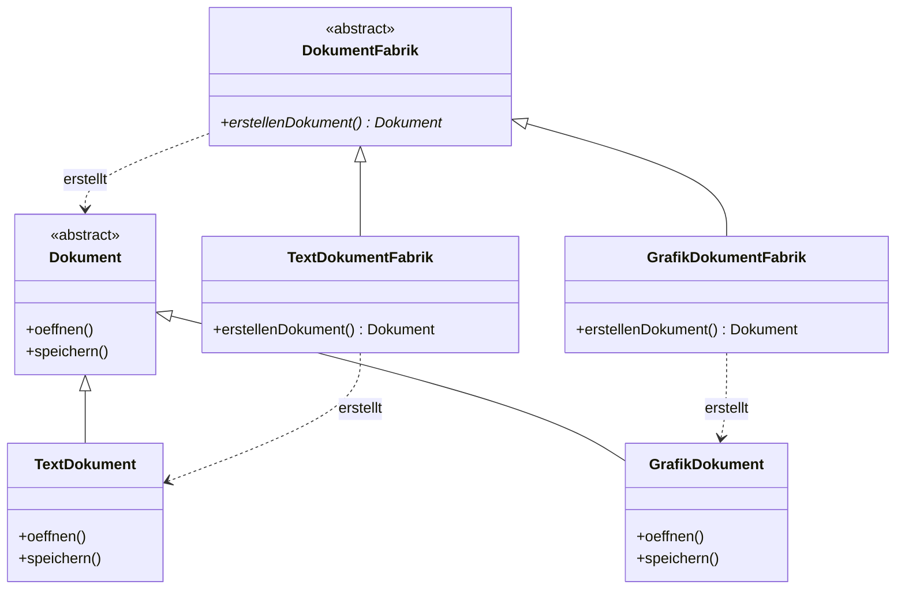

# [[Objektorientierte_Programmierung]]

- **Kernkonzept:** Die **Objektorientierte_Programmierung** (OOP) ist ein [[Programmierparadigma]], das Software als Sammlung interagierender [[Objekt|Objekte]] modelliert, die Instanzen von [[Klasse|Klassen]] sind und sowohl Daten (Attribute) als auch Verhalten (Methoden) kapseln. OOP ermöglicht strukturierte, modularisierte und wiederverwendbare Softwareentwicklung durch zentrale Prinzipien wie [[Vererbung]], [[Polymorphismus]], [[Kapselung]] und [[Abstraktion]], wobei reale Domänen in technische Systeme abgebildet werden. Konzepte wie [[Fabrikmethode]] oder [[Komposition]] erhöhen Flexibilität und Wartbarkeit.
- **Nutzen & Zweck:** OOP löst das Problem unübersichtlicher und schwer wartbarer Code-Strukturen, die bei prozeduraler Programmierung entstehen, indem es [[Modularisierung]] und [[Wiederverwendung]] fördert. Durch die Abbildung realer Entitäten (z. B. `[[Kunde]]`, `[[Bestellung]]`) in [[Klasse|Klassen]] mit klaren [[Schnittstelle|Schnittstellen]] wird die Softwareentwicklung strukturierter, flexibler und leichter erweiterbar. Vorteile umfassen:

- **Erhöhte Wartbarkeit**: Durch klare Trennung von Verantwortlichkeiten (z. B. via [[Schnittstelle|Schnittstellen]] oder [[Design_by_Contract]]) lassen sich Änderungen lokal begrenzen und [[Refactoring]]-Maßnahmen vereinfachen.
- **Flexibilität**: Mechanismen wie [[Polymorphismus]] oder [[Strategie_Pattern]] ermöglichen dynamische Anpassungen zur Laufzeit, während [[Dependency_Injection]] die [[Lose_Kopplung|lose Kopplung]] von Komponenten unterstützt.
- **Domänenorientierung**: Die Modellierung von Geschäftsprozessen via [[UML]] (z. B. [[Klassendiagramm|Klassendiagramme]]) verbessert die Verständlichkeit und Kommunikation mit [[Stakeholder|Stakeholdern]].
- **Wiederverwendung**: Durch [[Vererbung]] oder [[Komposition]] (z. B. [[Decorator_Pattern]]) lassen sich bestehende Komponenten erweitern, was die Entwicklung beschleunigt und die [[Kohäsion]] erhöht.

Typische Anwendungsfälle sind die Entwicklung von [[Softwarearchitektur|Softwarearchitekturen]] (z. B. [[Schichtenarchitektur]]), die Implementierung von [[Entwurfsmuster|Entwurfsmustern]] oder die Modellierung von [[Event-gesteuertes_System|Event-gesteuerten Systemen]].
- **Abgrenzung & Grenzen:** OOP ist **kein Allheilmittel** und hat klare Grenzen:

- **Überengineering**: Unnötige Abstraktionen (z. B. zu tiefe [[Vererbung|Vererbungshierarchien]]) erhöhen die Komplexität ohne Mehrwert und verletzen das [[YAGNI]]-Prinzip.
- **Performance-Overhead**: Dynamische Mechanismen wie [[Polymorphismus]], [[Reflection]] oder [[Garbage_Collection]] können die Laufzeiteffizienz beeinträchtigen (im Vergleich zu prozeduraler oder funktionaler Programmierung).
- **Steile Lernkurve**: Konzepte wie [[Duck_Typing]], [[Metaprogrammierung]] oder [[Aspektorientierte_Programmierung]] erfordern tiefes Verständnis und können zu Missverständnissen führen.
- **Nicht für alle Probleme geeignet**: Datenflussorientierte Systeme (z. B. ETL-Prozesse, mathematische Algorithmen) lassen sich oft besser mit [[Funktionale_Programmierung|funktionaler Programmierung]] abbilden, da diese [[Zustandslosigkeit]] und [[Immutability]] priorisiert.

Stolpersteine:
- **Falsche Abstraktion**: Zu frühe oder zu späte Einführung von [[Schnittstelle|Schnittstellen]] oder [[Abstrakte_Klasse|abstrakten Klassen]] kann zu inflexiblen oder überkomplexen Designs führen.
- **Verletzung der [[Kapselung]]**: Direkter Zugriff auf Attribute statt Nutzung von Gettern/Settern oder [[Tell_Dont_Ask]]-Prinzip.
- **Missbrauch von [[Vererbung]]**: Verwendung für Code-Wiederverwendung statt für „is-a“-Beziehungen (besser: [[Komposition]] oder [[Mixin]]).
- **Unklare Verantwortlichkeiten**: Verletzung des [[Single_Responsibility_Principle]] (SRP) durch überladene [[Klasse|Klassen]] oder [[Gott_Objekt|Gott-Objekte]].
- **Tight Coupling**: Enge Kopplung zwischen [[Klasse|Klassen]] durch direkte Abhängigkeiten statt Nutzung von [[Schnittstelle|Schnittstellen]] oder [[Dependency_Injection]].
- **Beispiel / Code:** ### Beispiel 1: Grundlegende Klasse mit Kapselung und Methoden
```java
// Definition einer Klasse 'Person' mit Attributen und Methoden
public class Person {
    private String name;
    private int alter;

    // Konstruktor
    public Person(String name, int alter) {
        this.name = name;
        this.alter = alter;
    }

    // Getter und Setter für kontrollierten Zugriff
    public String getName() {
        return name;
    }

    public void setName(String name) {
        this.name = name;
    }

    public int getAlter() {
        return alter;
    }

    public void setAlter(int alter) {
        if (alter >= 0) {
            this.alter = alter;
        }
    }

    // Methode zur Ausgabe der Personendaten
    public void vorstellen() {
        System.out.println("Hallo, ich heiße " + name + " und bin " + alter + " Jahre alt.");
    }
}

// Verwendung der Klasse in einer Main-Methode
public class Main {
    public static void main(String[] args) {
        Person person = new Person("Max Mustermann", 30);
        person.vorstellen(); // Ausgabe: Hallo, ich heiße Max Mustermann und bin 30 Jahre alt.
    }
}
```

### Beispiel 2: [[Fabrikmethode]] zur Objekterzeugung
```java
public abstract class Dokument {
    public abstract void oeffnen();
    public abstract void speichern();
}

public class TextDokument extends Dokument {
    @Override
    public void oeffnen() {
        System.out.println("Textdokument geöffnet");
    }
    @Override
    public void speichern() {
        System.out.println("Textdokument gespeichert");
    }
}

public class GrafikDokument extends Dokument {
    @Override
    public void oeffnen() {
        System.out.println("Grafikdokument geöffnet");
    }
    @Override
    public void speichern() {
        System.out.println("Grafikdokument gespeichert");
    }
}

public abstract class DokumentFabrik {
    public abstract Dokument erstellenDokument();
}

public class TextDokumentFabrik extends DokumentFabrik {
    @Override
    public Dokument erstellenDokument() {
        return new TextDokument();
    }
}

public class GrafikDokumentFabrik extends DokumentFabrik {
    @Override
    public Dokument erstellenDokument() {
        return new GrafikDokument();
    }
}

// Nutzung:
DokumentFabrik fabrik = new TextDokumentFabrik();
Dokument doc = fabrik.erstellenDokument();
doc.oeffnen(); // Ausgabe: "Textdokument geöffnet"
```

### UML-Klassendiagramm zur [[Fabrikmethode]]


---

## 🔗 Stellordnung & Verbindungen
- **Stellordnung ID:** 4
- **Vorgänger / Parent:** keine
- **Folgezettel / Unterzettel:**
  - [[Klassen]]
  - [[Objekte]]
  - [[Polymorphie]]
  - [[Kapselung]]
- **Querverweise:**
  - [[Software_Engineering]]
  - [[Design-Prinzipien]]
