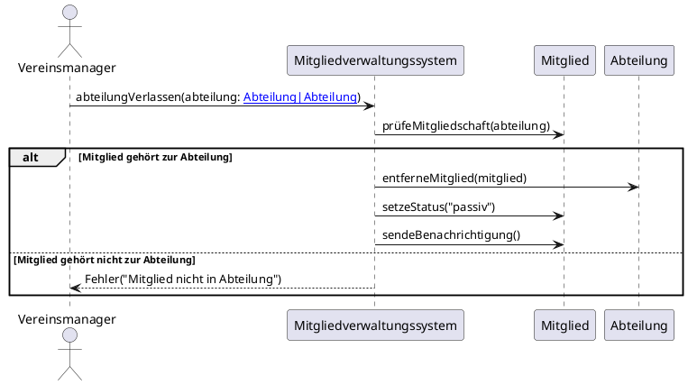

# [[Sequenzdiagramme]]

- **Kernkonzept:** Sequenzdiagramme sind eine [[UML-Diagramm|UML-Diagrammart]], die den zeitlichen Ablauf von [[Nachricht|Nachrichten]] und [[Interaktion|Interaktionen]] zwischen [[Objekt|Objekten]] oder [[Akteur|Akteuren]] in einem spezifischen [[Szenario]] eines [[Use_Case|Use Cases]] visualisiert. Sie betonen die Reihenfolge der [[Operation|Operationen]], die [[Lebenslinie|Lebensdauer]] der beteiligten [[Objekt|Objekte]] sowie deren [[Steuerungsfokus|Steuerungsfokus]], um dynamische Aspekte eines [[System|Systems]] präzise abzubilden.
- **Nutzen & Zweck:** Sequenzdiagramme dienen primär der Modellierung der dynamischen Aspekte eines [[System|Systems]] und helfen, komplexe [[Interaktionsmodellierung|Interaktionsabläufe]] verständlich darzustellen. Sie ermöglichen es [[Softwareentwickler|Entwicklern]] und [[Softwarearchitekt|Architekten]], die [[Kommunikation]] zwischen [[Komponente|Komponenten]] zu analysieren, logische Fehler frühzeitig zu erkennen und die Umsetzung von [[Use_Case|Use Cases]] präzise zu planen. Durch die klare Darstellung von [[Nachricht|Nachrichtenflüssen]], [[Abhängigkeit|Abhängigkeiten]] und [[Verantwortlichkeit|Verantwortlichkeiten]] der [[Objekt|Objekte]] tragen sie zur Identifikation von [[Lose_Kopplung|lose gekoppelten]] oder [[Kohäsion|hoch kohäsiven]] [[Design|Designs]] bei. Zudem unterstützen sie die [[Dokumentation]] und [[Kommunikation]] im Team, indem sie Abläufe visuell und nachvollziehbar machen, Missverständnisse zwischen [[Stakeholder|Stakeholdern]] vermeiden und [[Schnittstelle|Schnittstellen]] sowie Schlüsseloperationen für die Umsetzung eines [[Use_Case|Use Cases]] hervorheben. Sequenzdiagramme verbessern die Zusammenarbeit, indem sie die Reihenfolge von [[Nachricht|Nachrichten]] und die [[Steuerungsfokus|Steuerungsfokusse]] der beteiligten [[Objekt|Objekte]] klar aufzeigen.
- **Abgrenzung & Grenzen:** Sequenzdiagramme sind ungeeignet für die Darstellung statischer [[Struktur|Strukturen]] oder [[Beziehung|Beziehungen]] zwischen [[Klasse|Klassen]] – hierfür eignen sich [[Klassendiagramm|Klassendiagramme]] besser. Sie stoßen an ihre Grenzen bei der Modellierung von parallelen [[Prozess|Prozessen]] mit vielen Verzweigungen oder hochkomplexen Abläufen, da sie schnell unübersichtlich werden; in solchen Fällen sind [[Aktivitätsdiagramm|Aktivitätsdiagramme]] oder [[Zustandsdiagramm|Zustandsdiagramme]] vorzuziehen. Im Vergleich zu [[Kommunikationsdiagramm|Kommunikationsdiagrammen]] liegt ihr Fokus auf der zeitlichen Abfolge und nicht auf der strukturellen Organisation der [[Objekt|Objekte]]. Sequenzdiagramme beschreiben nur ein einzelnes [[Szenario]] und nicht alle möglichen Abläufe eines [[Use_Case|Use Cases]]. Sie sollten keine [[Implementierungsdetail|Implementierungsdetails]] abbilden, da sie auf einer höheren [[Abstraktionsebene]] arbeiten und keine [[Algorithmus|Algorithmen]] oder [[Datenstruktur|Datenstrukturen]] detailliert beschreiben. Zudem sind sie weniger geeignet, wenn die räumliche Verteilung der [[Komponente|Komponenten]] im Vordergrund steht.
- **Beispiel / Code:** ```java
// Beispiel 1: Sequenzdiagramm als textuelle Beschreibung (UML-Notation) für den Use Case "Mitglied bearbeiten"
// Akteur: Vereinsmanager
// Objekte: MyClub-System, Mitglied-Datenbank

Vereinsmanager -> MyClub-System: mitgliedBearbeiten(mitgliedID)
MyClub-System -> Mitglied-Datenbank: datenLaden(mitgliedID)
Mitglied-Datenbank --> MyClub-System: mitgliedDaten
MyClub-System -> MyClub-System: datenValidieren()
alt [Daten gültig]
    MyClub-System -> Mitglied-Datenbank: datenSpeichern(mitgliedDaten)
    Mitglied-Datenbank --> MyClub-System: bestätigung
    MyClub-System --> Vereinsmanager: erfolgMeldung
else [Daten ungültig]
    MyClub-System --> Vereinsmanager: fehlerMeldung
end

// Beispiel 2: Sequenzdiagramm-Szenario für den Use Case "Mitglied anmelden"
// Akteur: Mitglied
// Objekte: MitgliedVerwaltung, Datenbank

Mitglied -> MitgliedVerwaltung: anmelden(name, adresse)
MitgliedVerwaltung -> Datenbank: prüfeMitglied(name)
Datenbank --> MitgliedVerwaltung: MitgliedExistiertNicht
MitgliedVerwaltung -> Datenbank: speichereMitglied(name, adresse)
Datenbank --> MitgliedVerwaltung: Bestätigung
MitgliedVerwaltung --> Mitglied: Anmeldebestätigung

// Beispiel 3: Sequenzdiagramm als textuelle Darstellung (Pseudocode) für "Mitglied anlegen"
participant "Client" as Client
participant "ManageMembers" as Manager
participant "MitgliedRepository" as Repository

Client -> Manager: erstelleMitglied(name, adresse)
activate Manager
Manager -> Repository: speichereMitglied(mitglied)
activate Repository
Repository --> Manager: mitgliedId
deactivate Repository
Manager --> Client: mitgliedId
deactivate Manager
```



---

## 🔗 Stellordnung & Verbindungen
- **Stellordnung ID:** 1d1
- **Vorgänger / Parent:** [[UML]]
- **Folgezettel / Unterzettel:**
  - [[Lebenslinie]]
  - [[Steuerungsfokus]]
  - [[Nachrichtenfragment]]
- **Querverweise:** keine
