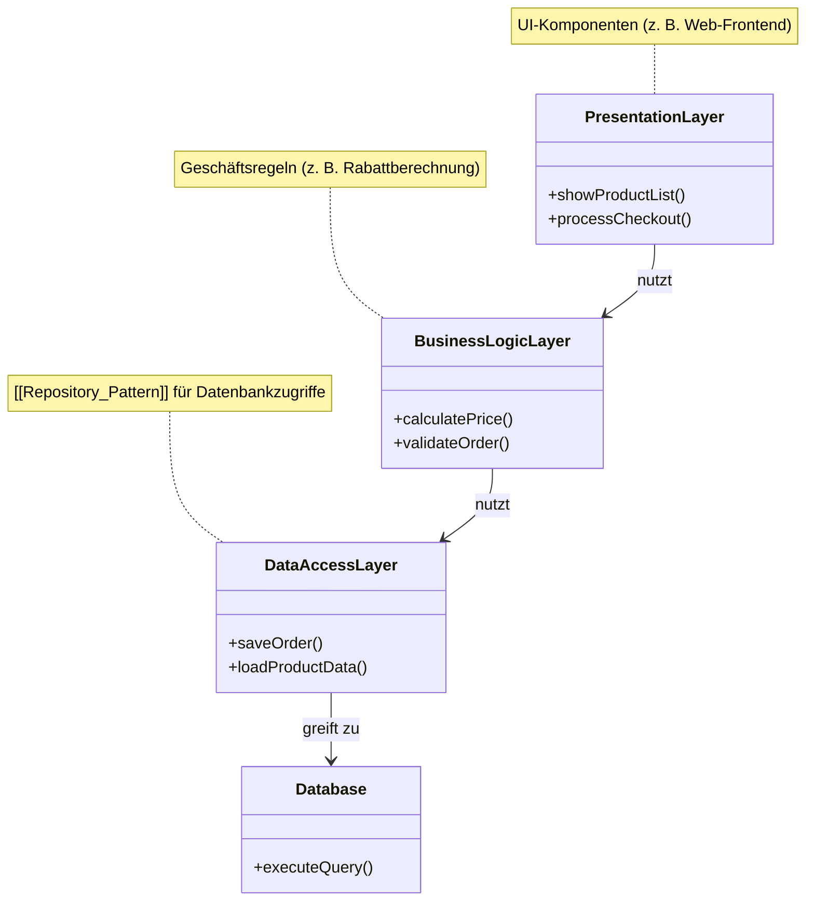

# [[Softwarearchitektur]]

- **Kernkonzept:** Die [[Softwarearchitektur]] bezeichnet die grundlegende [[Struktur]] eines [[Softwaresystem|Softwaresystems]], die durch die Definition von [[Komponente|Komponenten]], [[Konnektor|Konnektoren]], [[Modul|Modulen]] und deren [[Beziehung|Beziehungen]] zueinander sowie den Prinzipien für deren [[Entwurf]] und Weiterentwicklung entsteht. Sie dient als [[Bauplan]] für die [[agile_entwicklung|agile]], iterative und [[architekturorientierte_Entwicklung|architekturorientierte Entwicklung]], indem sie zentrale [[Anforderung|Anforderungen]] wie [[Skalierbarkeit]], [[Wartbarkeit]], [[Sicherheit]] und [[Anpassungsfähigkeit]] berücksichtigt und die [[Komplexität]] des Systems beherrschbar macht.
- **Nutzen & Zweck:** 1. **Strukturierung & Klarheit**: Schafft Übersicht über [[Systemkomponente|Systemkomponenten]] und deren [[Interaktion|Interaktionen]], z. B. durch [[Schichtenarchitektur]], [[Microservices]] oder [[Domain-Driven_Design]].
2. **Risikominimierung**: Ermöglicht die frühzeitige Identifikation von Konflikten (z. B. bei [[Performance]], [[Datenkonsistenz]] oder [[Schnittstelle|Schnittstellen]]) durch [[Modellierung]] (z. B. via [[UML]]-Diagramme wie [[Komponentendiagramm]] oder [[Sequenzdiagramm]]).
3. **Wiederverwendbarkeit & Modularität**: Fördert die Anwendung von [[Entwurfsmuster|Entwurfsmustern]] (z. B. [[Facade_Pattern]], [[Repository_Pattern]], [[Observer_Pattern]]) und [[Modularisierung]] zur Reduktion von Redundanzen.
4. **Kommunikation & Abstimmung**: Erleichtert die Zusammenarbeit zwischen [[Stakeholder|Stakeholdern]] (Entwickler, Architekten, Produktmanager) durch klare [[Dokumentation]] und visuelle Repräsentationen.
5. **Anpassungsfähigkeit & Evolution**: Unterstützt die [[Skalierbarkeit]] und [[Erweiterbarkeit]] des Systems durch [[Lose_Kopplung]], [[Dependency_Inversion_Principle]] und definierte [[Schnittstelle|Schnittstellen]].
6. **Agilität & Iteration**: Dient als Grundlage für iterative Entwicklung, indem sie Richtlinien für [[Refactoring]] und kontinuierliche Anpassung an neue [[Anforderung|Anforderungen]] vorgibt.
7. **Integration & Wartbarkeit**: Verbessert die [[Testbarkeit]] und [[Wartbarkeit]] durch klare Trennung von [[Verantwortlichkeit|Verantwortlichkeiten]] (z. B. via [[Separation_of_Concerns]]) und fördert die Integration von [[Teilsystem|Teilsystemen]].
8. **Beherrschung von Komplexität**: Löst das Problem der unkontrollierten [[Komplexität]] in großen Systemen, indem sie klare [[Verantwortlichkeit|Verantwortlichkeiten]], [[Schnittstelle|Schnittstellen]] und [[Abhängigkeit|Abhängigkeiten]] zwischen Systemteilen festlegt. Dies ermöglicht effiziente Zusammenarbeit in Teams und sichert die langfristige [[Anpassungsfähigkeit]] an neue [[Anforderung|Anforderungen]] oder Technologien.
- **Abgrenzung & Grenzen:** 1. **Kein Detaildesign**: Die [[Softwarearchitektur]] definiert *was* und *warum*, nicht *wie* im Kleinen (z. B. konkrete [[Algorithmus|Algorithmen]], [[Klassendiagramm|Klassenimplementierungen]] oder [[Datenstruktur|Datenstrukturen]]). Diese werden erst im [[Implementierungsmodell]] spezifiziert.
2. **Kein starres Konstrukt**: Architektur sollte nicht als unveränderlich betrachtet werden, da dies [[Agilität]] und [[Anpassungsfähigkeit]] einschränkt. Stattdessen muss sie kontinuierlich evaluiert und bei Bedarf angepasst werden (vgl. [[Evolutionäre_Architektur]]).
3. **Kein Ersatz für [[Refactoring]]**: Architektur ersetzt nicht die Notwendigkeit von [[Codequalität]]-Maßnahmen wie [[Refactoring]] oder [[Testautomatisierung]].
4. **Stolpersteine & Fallstricke**:
   - **Über-Engineering**: Zu frühe Festlegung auf komplexe [[Architekturmuster]] (z. B. [[Event_Driven_Architecture]], [[CQRS]]) ohne konkrete Notwendigkeit.
   - **Technische Schulden**: Vernachlässigung von [[Qualitätsattribut|Qualitätsattributen]] (z. B. [[Testbarkeit]], [[Performance]]) zugunsten schneller Lösungen.
   - **Stakeholder-Konflikte**: Unterschiedliche Prioritäten (z. B. [[Kosten]] vs. [[Flexibilität]]) erfordern Kompromisse und klare [[Priorisierung]].
   - **Ad-hoc-Entwicklung**: Fehlende architektonische Planung führt zu [[Technische_Schuld|technischen Schulden]], mangelnder [[Skalierbarkeit]] und schwer wartbaren Systemen.
5. **Grenzen der Anwendung**: [[Softwarearchitektur]] ist nicht sinnvoll für triviale oder kurzlebige [[Prototyp|Prototypen]], bei denen der Overhead der Strukturierung den Nutzen übersteigt. In solchen Fällen können monolithische Architekturen effizienter sein, während spezifische [[Architekturmuster]] wie [[Microservices]] oder [[Event-gesteuertes_System|Event-gesteuerte Systeme]] gezielt [[Nicht-funktionale_Anforderung|nicht-funktionale Anforderungen]] wie [[Skalierbarkeit]] oder [[Lose_Kopplung]] adressieren.
6. **KI & Automatisierung**: Automatisierte Architekturgenerierung (z. B. durch [[Large_Language_Models]]) kann Entwürfe beschleunigen, ersetzt aber keine menschliche Validierung von [[Nicht-funktionale_Anforderung|nicht-funktionalen Anforderungen]] oder [[Stakeholder]]-Abstimmungen.
- **Beispiel / Code:** ### Beispiel 1: Vereinfachte [[Schichtenarchitektur]] für ein E-Commerce-System (textuelle UML-Notation im Stil von Mermaid)


### Beispiel 2: Java-Implementierung einer [[Schichtenarchitektur]] für ein Mitgliedermanagement
```java
// Präsentationsebene (UI)
public class MitgliedUI {
    private MitgliedService mitgliedService;
    
    public MitgliedUI(MitgliedService mitgliedService) {
        this.mitgliedService = mitgliedService;
    }
    
    public void zeigeMitgliedLeistung(String name) {
        int leistung = mitgliedService.holeLeistungsprognose(name);
        System.out.println("Leistung von " + name + ": " + leistung);
    }
}

// Geschäftslogikschicht (Service)
public class MitgliedService {
    private MitgliedRepository mitgliedRepository;
    
    public MitgliedService(MitgliedRepository mitgliedRepository) {
        this.mitgliedRepository = mitgliedRepository;
    }
    
    public int holeLeistungsprognose(String name) {
        Mitglied mitglied = mitgliedRepository.findeMitglied(name);
        return mitglied.leistungsprognose(new Date());
    }
}

// Datenzugriffsschicht (Repository)
public class MitgliedRepository {
    public Mitglied findeMitglied(String name) {
        // Simulierter Datenbankzugriff
        return new Mitglied(name, "Musterstraße 1", new Date(), 100);
    }
}
```

### Beispiel 3: [[MVC-Architektur]] mit [[Observer_Pattern]] (vereinfacht)
```java
public interface Observer {
    void update(Object data);
}

public class Model {
    private List<Observer> observers = new ArrayList<>();
    private String state;

    public void addObserver(Observer o) {
        observers.add(o);
    }

    public void setState(String state) {
        this.state = state;
        notifyObservers();
    }

    private void notifyObservers() {
        for (Observer o : observers) {
            o.update(state);
        }
    }
}

public class View implements Observer {
    @Override
    public void update(Object data) {
        System.out.println("View aktualisiert: " + data);
    }
}
```

---

## 🔗 Stellordnung & Verbindungen
- **Stellordnung ID:** 3
- **Vorgänger / Parent:** keine
- **Folgezettel / Unterzettel:**
  - [[Schichtenarchitektur]]
  - [[Komponentenbasierte_Architektur]]
  - [[MVC]]
- **Querverweise:**
  - [[Design_Pattern]]
  - [[Software-Design]]
