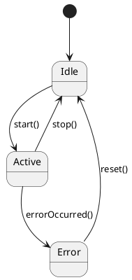

# [[Zustandsdiagramm]]

- **Kernkonzept:** Ein [[Zustandsdiagramm]] ist eine grafische [[Darstellung]] eines [[Protokollautomat|Protokollautomaten]] oder [[Endlicher_Automat|endlichen Automaten]] in der [[UML|Unified Modeling Language]], die die [[Zustand|Zustände]] eines [[Objekt|Objekts]], einer [[Komponente]] oder eines [[System|Systems]] sowie die [[Übergang|Übergänge]] zwischen diesen [[Zustand|Zuständen]] in Reaktion auf innere oder äußere [[Ereignis|Ereignisse]] visualisiert. Es modelliert das dynamische [[Verhalten]] von [[System|Systemen]] oder [[Komponente|Komponenten]], indem es zeigt, wie sich [[Attribut|Attribute]] und [[Verhalten]] in Abhängigkeit vom aktuellen [[Zustand]] ändern und wie [[Aktion|Aktionen]] mit [[Übergang|Übergängen]] verknüpft sind.
- **Nutzen & Zweck:** [[Zustandsdiagramm|Zustandsdiagramme]] dienen der präzisen [[Visualisierung]] und [[Komplexitätsbewältigung]] von [[System|Systemen]] mit dynamischem [[Verhalten]], insbesondere wenn dieses von [[Zustand|Zustandswechseln]], [[Bedingung|Bedingungen]] oder [[Ereignis|Ereignissen]] abhängt. Sie lösen das Problem, komplexe [[Ablauf|Abläufe]] mit klaren [[Zustand|Zustandsabhängigkeiten]] und [[Übergang|Übergangslogik]] verständlich darzustellen, was mit statischen [[Modell|Modellen]] wie [[Klassendiagramm|Klassendiagrammen]] nicht möglich ist. Durch die explizite Modellierung von [[Vorbedingung|Vor-]] und [[Nachbedingung|Nachbedingungen]] von [[Operation|Operationen]] sowie assoziierten [[Aktion|Aktionen]] erhöhen sie die [[Übersichtlichkeit]] und [[Wartbarkeit]] von [[Softwarearchitektur|Softwarearchitekturen]]. Sie unterstützen die [[Analyse]], das [[Design]] und die [[Kommunikation]] von [[Systemverhalten]] in der [[Objektorientierte_Programmierung|objektorientierten Entwicklung]], z. B. bei der Modellierung von [[Event-gesteuertes_System|Event-gesteuerten Systemen]], [[Reaktives_System|reaktiven Systemen]], [[Protokoll|Protokollen]], [[Benutzerinteraktion|Benutzerinteraktionen]] oder [[Lebenszyklus|Lebenszyklen]] von [[Entität|Entitäten]]. Besonders wertvoll sind sie für die Identifikation von [[Zustand|Zustandsabhängigkeiten]], die Spezifikation von [[Übergang|Übergangsbedingungen]] und die Dokumentation von [[Trigger|auslösenden Ereignissen]] sowie [[Aktion|Aktionen]], die mit [[Zustand|Zustandswechseln]] verbunden sind. Zudem verbessern sie die Nachvollziehbarkeit von [[Systemverhalten]] und reduzieren Fehler durch unklare [[Zustand|Zustände]]. Zustandsdiagramme erleichtern die Implementierung von [[Zustandsmaschine|Zustandsmaschinen]] und sichern die Konsistenz zwischen [[Design]] und [[Implementierung]].
- **Abgrenzung & Grenzen:** [[Zustandsdiagramm|Zustandsdiagramme]] sind ungeeignet für die Darstellung von [[Algorithmus|Algorithmen]], [[Datenfluss|Datenflüssen]], parallelen [[Ablauf|Abläufen]] oder kontinuierlichen [[Zustand|Zustandsänderungen]] – hier sind [[Aktivitätsdiagramm|Aktivitätsdiagramme]], [[Petri-Netz|Petri-Netze]], [[Sequenzdiagramm|Sequenzdiagramme]] oder [[Klassendiagramm|Klassendiagramme]] besser geeignet. Sie unterscheiden sich von [[Sequenzdiagramm|Sequenzdiagrammen]], die [[Interaktion|Interaktionen]] zwischen [[Objekt|Objekten]] über die Zeit zeigen, und von [[Aktivitätsdiagramm|Aktivitätsdiagrammen]], die den Fokus auf den Ablauf von [[Aktivität|Aktivitäten]] legen. Zudem eignen sie sich weniger für [[System|Systeme]] mit extrem vielen [[Zustand|Zuständen]] oder unklaren [[Übergang|Übergängen]], da die [[Diagramm|Diagramme]] dann unübersichtlich werden. Für die Modellierung von [[Nebenläufigkeit]] oder [[Verteilte_System|verteilten Systemen]] sind [[Aktivitätsdiagramm|Aktivitätsdiagramme]] oder [[Kommunikationsdiagramm|Kommunikationsdiagramme]] oft vorzuziehen. [[Zustandsdiagramm|Zustandsdiagramme]] konzentrieren sich auf das interne [[Verhalten]] eines einzelnen [[Objekt|Objekts]], einer [[Komponente]] oder eines [[System|Systems]], während andere [[UML|UML-Diagramme]] [[Struktur]] oder [[Interaktion]]en abbilden. Sie sollten nicht genutzt werden, wenn das [[System]] keine oder nur triviale [[Zustand|Zustandsabhängigkeiten]] aufweist, da der Modellierungsaufwand dann unnötig ist. Bei rein sequenziellen [[Ablauf|Abläufen]] ohne [[Zustand|Zustandswechsel]] sind [[Flussdiagramm|Flussdiagramme]] oder [[Pseudocode]] oft besser geeignet. Zustandsdiagramme verursachen unnötigen Overhead, wenn das [[Systemverhalten]] primär durch [[Algorithmus|Algorithmen]] oder [[Datenfluss|Datenflüsse]] beschrieben wird.
- **Beispiel / Code:** ```mermaid
stateDiagram-v2
    [*] --> Inaktiv
    Inaktiv --> Aktiv: abheben()
    Aktiv --> Inaktiv: auflegen()
    Aktiv --> Wählen: Nummer_wählen()
    Wählen --> Verbunden: [Gegenstelle_nimmt_an]
    Verbunden --> Aktiv: auflegen()
    Verbunden --> Fehler: [Timeout]
    Fehler --> Inaktiv: reset()
    state Aktiv {
        [*] --> Mitglied_aktiv
        Mitglied_aktiv --> Mitglied_aktiv: Beitragszahlung
    }
```



```java
public enum State {
    LOGIN,
    MEMBER_MANAGEMENT,
    EDIT_MEMBER,
    LOGOUT,
    STARTED,
    VALIDATION_FAILED;
    
    private List<State> subStates;
    
    private State(State... subS) {
        this.subStates = Arrays.asList(subS);
    }
    
    public boolean isSubStateOf(State state) {
        return state != null && (this == state || subStates.stream().anyMatch(s -> s.isSubStateOf(state)));
    }
}

public class StateMachineImpl implements StateMachine {
    private State currentState;
    
    public StateMachineImpl() {
        this.currentState = State.LOGIN;
    }
    
    public void transitionTo(State newState) {
        this.currentState = newState;
        System.out.println("[[Zustand|Zustand]] geändert zu: " + newState);
    }
    
    public State getCurrentState() {
        return currentState;
    }
}
```

Die Beispiele zeigen verschiedene Anwendungsfälle von [[Zustandsdiagramm|Zustandsdiagrammen]]:
- **Telefonanruf**: Modelliert die [[Zustand|Zustände]] eines Telefons mit [[Übergang|Übergängen]] wie *abheben*, *auflegen* und *Nummer wählen*, inklusive [[Bedingung|Bedingungen]] (z. B. *Gegenstelle nimmt an*).
- **Systemsteuerung**: Ein einfaches [[System]] mit [[Zustand|Zuständen]] wie *Idle*, *Active* und *Error*, wobei [[Ereignis|Ereignisse]] wie *start()*, *stop()* oder *errorOccurred()* die [[Übergang|Übergänge]] auslösen.
- **Vereinsmitglied**: Zeigt den [[Lebenszyklus]] eines Vereinsmitglieds mit [[Zustand|Zuständen]] wie *Aktiv* (inkl. [[Unterzustand|Unterzuständen]]) und *Passiv* sowie [[Übergang|Übergängen]] basierend auf [[Ereignis|Ereignissen]] wie *Mitglied tritt Abteilung bei* oder *Beitragszahlung*.
- **Java-Implementierung**: Demonstriert die Umsetzung von [[Zustand|Zuständen]] und [[Unterzustand|Unterzuständen]] in [[Enumeration|Enumerationen]] sowie die Implementierung einer [[Zustandsmaschine]] mit [[Schnittstelle|Schnittstellen]] und [[Klasse|Klassen]], wie sie in [[Protokoll|Protokollen]] oder [[Lebenszyklus|Lebenszyklen]] von [[Entität|Entitäten]] verwendet werden können (z. B. im *MyClub*-System). Die erweiterte Version zeigt zusätzlich die [[Hierarchie]] von [[Unterzustand|Unterzuständen]] (z. B. *MEMBER_MANAGEMENT* als [[Unterzustand]] von *LOGIN*).
