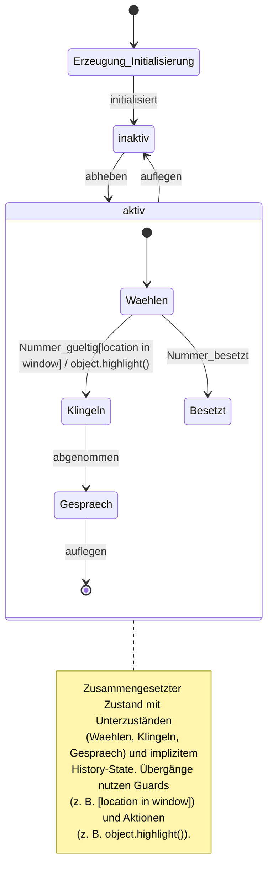

# [[Zustandsuebergang]]

- **Kernkonzept:** Ein **Zustandsübergang** (engl. *state transition*) beschreibt in einer [[Zustandsmaschine]] den gerichteten Wechsel von einem [[Zustand]] zu einem anderen, ausgelöst durch ein definiertes [[Ereignis]] (Trigger) und gesteuert durch [[Bedingung|Bedingungen]] (*Guards*) sowie assoziierte [[Aktion|Aktionen]] (*Action-Expressions*). Er formalisiert das Verhalten eines [[System|Systems]] oder [[Objekt|Objekts]] durch explizite Modellierung zulässiger [[Zustandswechsel]] und ist zentral für die [[Verhaltensmodellierung]] in [[UML]] und [[Entwurfsmuster|State-Pattern]].
- **Nutzen & Zweck:** Zustandsübergänge lösen das Problem unklarer [[Systemdynamik]] durch präzise Definition erlaubter Operationen und deren Auswirkungen auf den Systemzustand. Sie ermöglichen die Nachvollziehbarkeit von [[Zustandsänderung|Zustandsänderungen]], verhindern inkonsistente Systemzustände durch klare Vor- und Nachbedingungen und reduzieren Komplexität in [[Event-gesteuertes_System|Event-gesteuerten Systemen]]. Typische Anwendungsfälle umfassen:

- **Steuerung komplexer Abläufe**: z. B. im [[Entwurfsmuster|State-Pattern]] zur Kapselung zustandsabhängiger Logik und [[Lose_Kopplung|lose Kopplung]] von Verhalten.
- **Protokollimplementierung**: z. B. Netzwerkkommunikation (TCP-Handshake) oder Gerätesteuerung (Telefon, Mikrowellen).
- **Validierung von Systemverhalten**: Durch formale Spezifikation von Übergängen können Fehler wie unerreichbare [[Zustand|Zustände]], [[Deadlock]]s oder [[Race_Condition|Race-Conditions]] früh erkannt werden.
- **Codegenerierung**: [[UML]]-Modellierer können aus [[Zustandsdiagramm|Zustandsdiagrammen]] direkt ausführbaren Code für [[Embedded_System|Embedded-Systeme]] oder [[Echtzeitsystem|Echtzeitsysteme]] erzeugen.
- **Deterministisches Verhalten**: In [[Determinismus|deterministischen]] Zustandsmaschinen führt ein [[Ereignis]] in einem Zustand zu genau einem Folgezustand, was die Vorhersagbarkeit und Testbarkeit verbessert.
- **Abgrenzung & Grenzen:** **Einsatzgrenzen & Alternativen**: Zustandsübergänge sind ungeeignet für Systeme mit primär datengetriebener oder algorithmisch komplexer Logik ohne klare Zustandsabhängigkeiten. Alternativen umfassen:
- **Regelbasierte Systeme**: Für kontinuierliche Datenverarbeitung oder mathematische Transformationen (z. B. [[Expertensystem|Expertensysteme]]).
- **Funktionale Programmierung**: Bei Systemen mit hohem Anteil an [[Seiteneffekt|seiteneffektfreier]] Logik (z. B. [[Haskell]] oder [[Clojure]]).
- **Sequentielle Anweisungen**: Für einfache Abläufe ohne Zustandsabhängigkeiten (z. B. lineare Skripte).

**Stolpersteine & Herausforderungen**:
- **Zyklische Übergänge**: Können zu [[Endlosschleife|Endlosschleifen]] führen (z. B. Zustand A → B → A), wenn keine Abbruchbedingungen definiert sind.
- **Fehlende Guards**: Ohne explizite [[Bedingung|Bedingungen]] können unerwünschte Übergänge ausgelöst werden, was zu undefiniertem Verhalten führt.
- **Nicht-deterministische Übergänge**: Mehrere mögliche Folgezustände erfordern zusätzliche Regeln (z. B. Priorisierung oder [[Zufallsauswahl]]), um [[Determinismus]] zu gewährleisten.
- **Granularität & Komplexität**: Übergänge zwischen [[Zusammengesetzte_Zustaende|zusammengesetzten Zuständen]] oder mit [[History_State|History-States]] erhöhen die Modellierungskomplexität. Hier sind klare [[Modularisierung|Modularisierungsstrategien]] und [[Dokumentation]] essenziell.
- **Implizite Annahmen**: Übergänge sollten alle möglichen [[Ereignis|Ereignisse]] abdecken, um undefiniertes Verhalten zu vermeiden (z. B. durch einen *Default-Übergang* in [[UML]]).
- **Parallelität**: In [[Nebenläufigkeit|nebenläufigen Systemen]] müssen Übergänge thread-sicher implementiert werden, um [[Race_Condition|Race-Conditions]] zu vermeiden (z. B. durch [[Synchronisation]] oder [[Actor_Model|Actor-Modelle]]).
- **Beispiel / Code:** ### UML-Zustandsdiagramm (Mermaid-Syntax)


### Java-Implementierung (State-Pattern)
```java
// Beispiel eines Zustandsübergangs in einer StateMachine mit Guards und Aktionen
public interface State {
    void handleEvent(Context context, Event event);
    boolean isSubStateOf(State allowedState);
}

public class Context {
    private State currentState;
    private final List<Observer> observers = new ArrayList<>();

    public void setState(State newState) {
        if (currentState.isSubStateOf(newState)) {  // Guard-Condition
            currentState = newState;                 // Zustandsübergang
            observers.forEach(obs -> obs.update(newState)); // Action-Expression
        }
    }
    public void addObserver(Observer observer) {
        observers.add(observer);
    }
}

// Beispiel-Trigger mit Guard und Aktion
public class RightMouseDownEvent implements Event {
    private final Point location;
    
    public void trigger(Context context) {
        if (location.inWindow()) {  // Guard
            Object object = context.pickObject(location);
            object.highlight();      // Aktion
            context.setState(new HighlightedState());
        }
    }
}
```

### Formale Notation (UML-ähnlich)
```
trigger [guard-condition] / action-expression

// Beispiel: Mausklick-Übergang
rightMouseDown(location) [location in window] / 
    object := pickObject(location); 
    object.highlight();
```

---

## 🔗 Stellordnung & Verbindungen
- **Stellordnung ID:** 1c2a
- **Vorgänger / Parent:** [[Zustandsverwaltung]]
- **Folgezettel / Unterzettel:**
  - [[Protokoll-Automaten]]
  - [[Guard-Conditions]]
- **Querverweise:**
  - [[State-Pattern]]
  - [[Zustandsverwaltung]]
